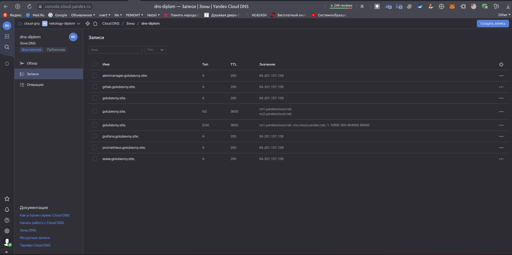
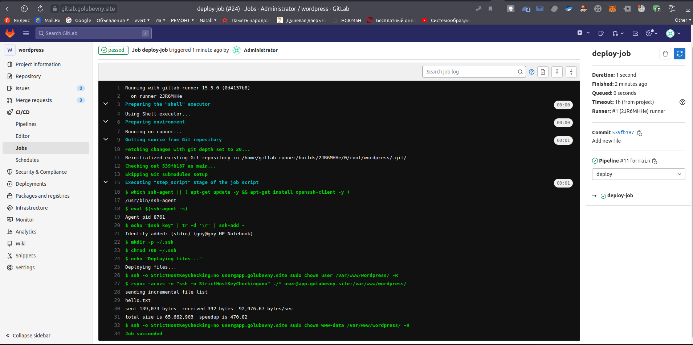

diplom-my
# Дипломный практикум в YandexCloud
  * [Цели:](#цели)
  * [Этапы выполнения:](#этапы-выполнения)
      * [Регистрация доменного имени](#регистрация-доменного-имени)
      * [Создание инфраструктуры](#создание-инфраструктуры)
          * [Установка Nginx и LetsEncrypt](#установка-nginx)
          * [Установка кластера MySQL](#установка-mysql)
          * [Установка WordPress](#установка-wordpress)
          * [Установка Gitlab CE, Gitlab Runner и настройка CI/CD](#установка-gitlab)
          * [Установка Prometheus, Alert Manager, Node Exporter и Grafana](#установка-prometheus)
  * [Что необходимо для сдачи задания?](#что-необходимо-для-сдачи-задания)
  * [Как правильно задавать вопросы дипломному руководителю?](#как-правильно-задавать-вопросы-дипломному-руководителю)

---
## Цели:

1. Зарегистрировать доменное имя (любое на ваш выбор в любой доменной зоне).
2. Подготовить инфраструктуру с помощью Terraform на базе облачного провайдера YandexCloud.
3. Настроить внешний Reverse Proxy на основе Nginx и LetsEncrypt.
4. Настроить кластер MySQL.
5. Установить WordPress.
6. Развернуть Gitlab CE и Gitlab Runner.
7. Настроить CI/CD для автоматического развёртывания приложения.
8. Настроить мониторинг инфраструктуры с помощью стека: Prometheus, Alert Manager и Grafana.

---
## Этапы выполнения:

### Регистрация доменного имени

Подойдет любое доменное имя на ваш выбор в любой доменной зоне.

ПРИМЕЧАНИЕ: Далее в качестве примера используется домен `you.domain` замените его вашим доменом.

Рекомендуемые регистраторы:
  - [nic.ru](https://nic.ru)
  - [reg.ru](https://reg.ru)

Цель:

1. Получить возможность выписывать [TLS сертификаты](https://letsencrypt.org) для веб-сервера.

Ожидаемые результаты:

1. У вас есть доступ к личному кабинету на сайте регистратора.
2. Вы зарезистрировали домен и можете им управлять (редактировать dns записи в рамках этого домена).

---

Есть зарегистрированное имя `golubevny.site` у регистратора `reg.ru`.


Делегировал его `DNS` на `ns1.yandexcloud.net` и `ns2.yandexcloud.net`, так как будет использоваться `DNS` от `YC`. Для этого создадим файл `dns.tf` и укажем в нем:

```hcl
resource "yandex_dns_zone" "diplom" {
  name        = "dns-diplom"
  description = "Diplom Netology public zone"

  labels = {
    label1 = "diplom-public"
  }

  zone    = "golubevny.site."
  public  = true

  depends_on = [
    yandex_vpc_subnet.net-101,yandex_vpc_subnet.net-102
  ]
}

resource "yandex_dns_recordset" "def" {
  zone_id = yandex_dns_zone.diplom.id
  name    = "@.golubevny.site."
  type    = "A"
  ttl     = 200
  data    = [yandex_vpc_address.addr.external_ipv4_address[0].address]
}

resource "yandex_dns_recordset" "gitlab" {
  zone_id = yandex_dns_zone.diplom.id
  name    = "gitlab.golubevny.site."
  type    = "A"
  ttl     = 200
  data    = [yandex_vpc_address.addr.external_ipv4_address[0].address]
}

resource "yandex_dns_recordset" "alertmanager" {
  zone_id = yandex_dns_zone.diplom.id
  name    = "alertmanager.golubevny.site."
  type    = "A"
  ttl     = 200
  data    = [yandex_vpc_address.addr.external_ipv4_address[0].address]
}

resource "yandex_dns_recordset" "grafana" {
  zone_id = yandex_dns_zone.diplom.id
  name    = "grafana.golubevny.site."
  type    = "A"
  ttl     = 200
  data    = [yandex_vpc_address.addr.external_ipv4_address[0].address]
}

resource "yandex_dns_recordset" "prometheus" {
  zone_id = yandex_dns_zone.diplom.id
  name    = "prometheus.golubevny.site."
  type    = "A"
  ttl     = 200
  data    = [yandex_vpc_address.addr.external_ipv4_address[0].address]
}

resource "yandex_dns_recordset" "www" {
  zone_id = yandex_dns_zone.diplom.id
  name    = "www.golubevny.site."
  type    = "A"
  ttl     = 200
  data    = [yandex_vpc_address.addr.external_ipv4_address[0].address]
}
```


Для аренды статического ip-адреса в YC добавим в файл `network.tf`:

```hcl
resource "yandex_vpc_address" "addr" {
  name = "ip-${terraform.workspace}"
  external_ipv4_address {
    zone_id = "ru-central1-a"
  }
}
```


---

### Создание инфраструктуры

Для начала необходимо подготовить инфраструктуру в YC при помощи [Terraform](https://www.terraform.io/).

Особенности выполнения:

- Бюджет купона ограничен, что следует иметь в виду при проектировании инфраструктуры и использовании ресурсов;
- Следует использовать последнюю стабильную версию [Terraform](https://www.terraform.io/).

Предварительная подготовка:

1. Создайте сервисный аккаунт, который будет в дальнейшем использоваться Terraform для работы с инфраструктурой с необходимыми и достаточными правами. Не стоит использовать права суперпользователя
2. Подготовьте [backend](https://www.terraform.io/docs/language/settings/backends/index.html) для Terraform:
   а. Рекомендуемый вариант: [Terraform Cloud](https://app.terraform.io/)  
   б. Альтернативный вариант: S3 bucket в созданном YC аккаунте.
3. Настройте [workspaces](https://www.terraform.io/docs/language/state/workspaces.html)
   а. Рекомендуемый вариант: создайте два workspace: *stage* и *prod*. В случае выбора этого варианта все последующие шаги должны учитывать факт существования нескольких workspace.  
   б. Альтернативный вариант: используйте один workspace, назвав его *stage*. Пожалуйста, не используйте workspace, создаваемый Terraform-ом по-умолчанию (*default*).
4. Создайте VPC с подсетями в разных зонах доступности.
5. Убедитесь, что теперь вы можете выполнить команды `terraform destroy` и `terraform apply` без дополнительных ручных действий.
6. В случае использования [Terraform Cloud](https://app.terraform.io/) в качестве [backend](https://www.terraform.io/docs/language/settings/backends/index.html) убедитесь, что применение изменений успешно проходит, используя web-интерфейс Terraform cloud.

Цель:

1. Повсеместно применять IaaC подход при организации (эксплуатации) инфраструктуры.
2. Иметь возможность быстро создавать (а также удалять) виртуальные машины и сети. С целью экономии денег на вашем аккаунте в YandexCloud.

Ожидаемые результаты:

1. Terraform сконфигурирован и создание инфраструктуры посредством Terraform возможно без дополнительных ручных действий.
2. Полученная конфигурация инфраструктуры является предварительной, поэтому в ходе дальнейшего выполнения задания возможны изменения.

---

Использован сервисный аккаунт - `robot`.
Бекенд подготавливается отдельным конфигом терраформа [s3](scripts/terraform/s3/), 
а затем он используется в качестве хранилища `backend` для `workspace` ["stage"](scripts/terraform/stage).

Используется один воркспейс `"stage"`.

`VPC` в разных зонах доступности, настроена маршрутизация:

```hcl
resource "yandex_vpc_network" "default" {
  name = "net-${terraform.workspace}"
}

resource "yandex_vpc_route_table" "route-table" {
  name                    = "nat-instance-route"
  network_id              = "${yandex_vpc_network.default.id}"
  static_route {
    destination_prefix    = "0.0.0.0/0"
    next_hop_address      = var.lan_proxy_ip
  }
}

resource "yandex_vpc_subnet" "net-101" {
  name = "subnet-${terraform.workspace}-101"
  zone           = "ru-central1-a"
  network_id     = "${yandex_vpc_network.default.id}"
  v4_cidr_blocks = ["192.168.101.0/24"]
  route_table_id          = yandex_vpc_route_table.route-table.id
}

resource "yandex_vpc_subnet" "net-102" {
  name = "subnet-${terraform.workspace}-102"
  zone           = "ru-central1-b"
  network_id     = "${yandex_vpc_network.default.id}"
  v4_cidr_blocks = ["192.168.102.0/24"]
  route_table_id          = yandex_vpc_route_table.route-table.id
}
```


Из каталога `s3`, для создания бакета в `YC` выполняем:

```bash
export YC_TOKEN=$(yc config get token)
terraform init
terraform plan
terraform apply --auto-approve
```


Из файла `terraform.tfstate` берем значения `access_key` и `secret_key` и заносим их в файл `stage\main.tf`.

Далее переходим в каталог `stage` и выполняем:

```bash
export YC_TOKEN=$(yc config get token)
terraform init
terraform workspace new stage
terraform init
terraform plan
terraform apply --auto-approve
```


В результате создаются 7 виртуальных машин (5 - `Ubuntu 22.04`, 1 - `Ubuntu 20.04`, proxy - `ubuntu 18.04 NAT Instance`).

Создаются сеть и две внутренние подсети `192.168.101.0/24` и `192.168.102.0/24`.

Настраиваются маршруты между ними.

Арендуется белый IP.

Прописываются `DNS` `YC` в соответствии с заданием.


Состояние воркспейса `stage` сохраняется в `S3` бакете `YC`.





Далее экспортируем значения ip-адресов в переменные окружения и используем утилиту `envsubst` для формирования файла `ansible\hosts` из шаблона`terraform\stage\hosts.j2` и переменных окружения. 


Для этого запускаем скрипт `terraform\stage\hosts_export.sh` следующего содержания:

```bash
# /bin/bash
export internal_ip_address_app_yandex_cloud=$(terraform output -json internal_ip_address_app_yandex_cloud)
export internal_ip_address_db01_yandex_cloud=$(terraform output -json internal_ip_address_db01_yandex_cloud)
export internal_ip_address_db02_yandex_cloud=$(terraform output -json internal_ip_address_db02_yandex_cloud)
export internal_ip_address_gitlab_yandex_cloud=$(terraform output -json internal_ip_address_gitlab_yandex_cloud)
export internal_ip_address_monitoring_yandex_cloud=$(terraform output -json internal_ip_address_monitoring_yandex_cloud)
export internal_ip_address_proxy_wan_yandex_cloud=$(terraform output -json internal_ip_address_proxy_wan_yandex_cloud)
export internal_ip_address_runner_yandex_cloud=$(terraform output -json internal_ip_address_runner_yandex_cloud)
envsubst < hosts.j2 > ../../ansible/hosts
echo "Export compleate!"
```

---
---
### Установка Nginx и LetsEncrypt

Необходимо разработать Ansible роль для установки Nginx и LetsEncrypt.

**Для получения LetsEncrypt сертификатов во время тестов своего кода пользуйтесь [тестовыми сертификатами](https://letsencrypt.org/docs/staging-environment/), так как количество запросов к боевым серверам LetsEncrypt [лимитировано](https://letsencrypt.org/docs/rate-limits/).**

Рекомендации:
  - Имя сервера: `you.domain`
  - Характеристики: 2vCPU, 2 RAM, External address (Public) и Internal address.

Цель:

1. Создать reverse proxy с поддержкой TLS для обеспечения безопасного доступа к веб-сервисам по HTTPS.

Ожидаемые результаты:

1. В вашей доменной зоне настроены все A-записи на внешний адрес этого сервера:
    - `https://www.you.domain` (WordPress)
    - `https://gitlab.you.domain` (Gitlab)
    - `https://grafana.you.domain` (Grafana)
    - `https://prometheus.you.domain` (Prometheus)
    - `https://alertmanager.you.domain` (Alert Manager)
2. Настроены все upstream для выше указанных URL, куда они сейчас ведут на этом шаге не важно, позже вы их отредактируете и укажите верные значения.
2. В браузере можно открыть любой из этих URL и увидеть ответ сервера (502 Bad Gateway). На текущем этапе выполнение задания это нормально!

---

Использовались следующие материалы:

https://github.com/coopdevs/certbot_nginx

https://github.com/geerlingguy/ansible-role-certbot/

Если нужно генерировать тестовый, то в дефолтных значениях нужно прописать :

```yaml
letsencrypt_staging: true
```

Переходим в директорию с `Ansible` и выполняем `ansible-playbook proxy.yml` :


<details>
<summary>Вывод Ansible</summary>

```bash

gny@gny-HP-Notebook:~/rep/diplom-my/scripts/ansible(main)$ ansible-playbook proxy.yml 


PLAY [proxy] *****************************************************************************************************************************************************************************************

TASK [Gathering Facts ] ******************************************************************************************************************************************************************************
ok: [golubevny.site]

TASK [proxy : Install Nginx name=nginx, state=latest, update_cache=True] *****************************************************************************************************************************
changed: [golubevny.site]

TASK [proxy : Set Certbot package name and versions (Ubuntu >= 20.04) certbot_version=0.40.0-1ubuntu0.1, certbot_nginx_version=0.40.0-0ubuntu0.1, certbot_nginx_name=python3-certbot-nginx] **********
skipping: [golubevny.site]

TASK [proxy : Set Certbot package name and versions (Ubuntu < 20.04) certbot_version=0.31.0-2~deb10u1+ubuntu{{ ansible_distribution_version }}.1+certbot+3, certbot_nginx_version=0.31.0-1+ubuntu{{ ansible_distribution_version }}.1+certbot+1, certbot_nginx_name=python-certbot-nginx] ***
ok: [golubevny.site]

TASK [proxy : Add certbot repository repo=ppa:certbot/certbot, state=present] ************************************************************************************************************************
changed: [golubevny.site]

TASK [proxy : Install certbot name=certbot={{ certbot_version }}, state=present] *********************************************************************************************************************
changed: [golubevny.site]

TASK [proxy : Install certbot-nginx plugin name={{ certbot_nginx_name }}={{ certbot_nginx_version }}, state=present] *********************************************************************************
changed: [golubevny.site]

TASK [proxy : Check if certificate already exists path=/etc/letsencrypt/live/{{ domain_name }}/cert.pem] *********************************************************************************************
ok: [golubevny.site]

TASK [proxy : Force generation of a new certificate _raw_params=certbot certonly --nginx --force-renewal --email '{{ letsencrypt_email }}' --agree-tos --no-eff-email -d '{{ domain_name }}' -d 'www.{{ domain_name }}' -d 'gitlab.{{ domain_name  }}' -d 'grafana.{{ domain_name  }}' -d 'prometheus.{{ domain_name }}' -d 'alertmanager.{{ domain_name }}'  --non-interactive   --staging   --break-my-certs 
] ***
changed: [golubevny.site]

TASK [proxy : Add cron job for certbot renewal name=Certbot automatic renewal, job=certbot renew, month=*/2] *****************************************************************************************
changed: [golubevny.site]

TASK [proxy : Add nginx.conf src=templates/nginx.conf.j2, dest=/etc/nginx/nginx.conf] ****************************************************************************************************************
changed: [golubevny.site]

TASK [proxy : Add default site src=templates/nginx_default.conf.j2, dest=/etc/nginx/sites-enabled/default] *******************************************************************************************
changed: [golubevny.site]

TASK [proxy : Add site conf src=templates/nginx_sites.conf.j2, dest=/etc/nginx/sites-enabled/{{ domain_name }}.conf] *********************************************************************************
changed: [golubevny.site]

RUNNING HANDLER [proxy : nginx systemd name=nginx, enabled=True, state=started] **********************************************************************************************************************
ok: [golubevny.site]

RUNNING HANDLER [proxy : nginx restart name=nginx, state=restarted] **********************************************************************************************************************************
changed: [golubevny.site]

PLAY RECAP *******************************************************************************************************************************************************************************************
golubevny.site             : ok=14   changed=10   unreachable=0    failed=0    skipped=1    rescued=0    ignored=0 
```

</details>

---


___
### Установка кластера MySQL

Необходимо разработать Ansible роль для установки кластера MySQL.

Рекомендации:
  - Имена серверов: `db01.you.domain` и `db02.you.domain`
  - Характеристики: 4vCPU, 4 RAM, Internal address.

Цель:

1. Получить отказоустойчивый кластер баз данных MySQL.

Ожидаемые результаты:

1. MySQL работает в режиме репликации Master/Slave.
2. В кластере автоматически создаётся база данных c именем `wordpress`.
3. В кластере автоматически создаётся пользователь `wordpress` с полными правами на базу `wordpress` и паролем `wordpress`.

**Вы должны понимать, что в рамках обучения это допустимые значения, но в боевой среде использование подобных значений не приемлимо! Считается хорошей практикой использовать логины и пароли повышенного уровня сложности. В которых будут содержаться буквы верхнего и нижнего регистров, цифры, а также специальные символы!**

---

Переменные задаем в файле `roles\mysql\defaults\main.yml`:

```
db_user: wordpress
db_pass: wordpress
db_name: wordpress
mysql_replication_master: db01.golubevny.site 
mysql_replication_user: replication_user
mysql_replication_user_password: "replication_user"

```

Конфигурация мастера в `roles\mysql\templates\master.cnf.j2`:

```bash
[mysqld]
# Replication
server-id = 1
log-bin = mysql-bin
log-bin-index = mysql-bin.index
log-error = mysql-bin.err
relay-log = relay-bin
relay-log-info-file = relay-bin.info
relay-log-index = relay-bin.index
expire_logs_days=7
binlog-do-db = {{ db_name }}
```

Конфигурация слэйва в  `roles\mysql\templates\slave.cnf.j2`:

```bash
[mysqld]
# Replication
server-id = 2
relay-log = relay-bin
relay-log-info-file = relay-log.info
relay-log-index = relay-log.index
replicate-do-db = {{ db_name }}
```
Используемые материалы:

[https://medium.com/@kelom.x/ansible-mysql-installation-2513d0f70faf](https://medium.com/@kelom.x/ansible-mysql-installation-2513d0f70faf)

[https://github.com/geerlingguy/ansible-role-mysql/blob/master/tasks/replication.yml](https://github.com/geerlingguy/ansible-role-mysql/blob/master/tasks/replication.yml)

[https://handyhost.ru/manuals/mysql/mysql-replication.html](https://handyhost.ru/manuals/mysql/mysql-replication.html)

Для создания кластера выполняем `ansible-playbook mysql.yml`

В случае возникновения следующей ошибки доступа по ssh для узлов:

```
PLAY [db01 db02] *************************************************************************************************************************************************************************************

TASK [Gathering Facts ] ******************************************************************************************************************************************************************************
fatal: [db02.golubevny.site]: UNREACHABLE! => {"changed": false, "msg": "Failed to connect to the host via ssh: kex_exchange_identification: Connection closed by remote host\r\nConnection closed by UNKNOWN port 65535", "unreachable": true}
fatal: [db01.golubevny.site]: UNREACHABLE! => {"changed": false, "msg": "Failed to connect to the host via ssh: kex_exchange_identification: Connection closed by remote host\r\nConnection closed by UNKNOWN port 65535", "unreachable": true}

PLAY RECAP *******************************************************************************************************************************************************************************************
db01.golubevny.site        : ok=0    changed=0    unreachable=1    failed=0    skipped=0    rescued=0    ignored=0   
db02.golubevny.site        : ok=0    changed=0    unreachable=1    failed=0    skipped=0    rescued=0    ignored=0 
```

Выполняем удаление отпечатков от предыдущих подключений по ssh к узлу golubevny.site:

```
gny@gny-HP-Notebook:~$ ssh-keygen -f "/home/gny/.ssh/known_hosts" -R "golubevny.site"

```
И запускаем заново `ansible-playbook mysql.yml`.

<details>
<summary>Вывод Ansible</summary>

```bash

gny@gny-HP-Notebook:~/rep/diplom-my/scripts/ansible(main)$ ansible-playbook mysql.yml

PLAY [db01 db02] *************************************************************************************************************************************************************************************

TASK [Gathering Facts ] ******************************************************************************************************************************************************************************
ok: [db02.golubevny.site]
ok: [db01.golubevny.site]

TASK [mysql : Installing Mysql and dependencies name={{ item }}, state=present, update_cache=True] ***************************************************************************************************
changed: [db01.golubevny.site] => (item=mysql-server)
changed: [db02.golubevny.site] => (item=mysql-server)
changed: [db02.golubevny.site] => (item=mysql-client)
changed: [db01.golubevny.site] => (item=mysql-client)
changed: [db02.golubevny.site] => (item=python3-mysqldb)
changed: [db01.golubevny.site] => (item=python3-mysqldb)
changed: [db02.golubevny.site] => (item=libmysqlclient-dev)
changed: [db01.golubevny.site] => (item=libmysqlclient-dev)

TASK [mysql : start and enable mysql service name=mysql, state=started, enabled=True] ****************************************************************************************************************
ok: [db01.golubevny.site]
ok: [db02.golubevny.site]

TASK [mysql : Creating database wordpress name={{db_name}}, state=present] ***************************************************************************************************************************
changed: [db01.golubevny.site]
changed: [db02.golubevny.site]

TASK [mysql : Creating mysql user wordpress name={{db_user}}, password={{db_pass}}, priv=*.*:ALL, host=%, state=present] *****************************************************************************
changed: [db01.golubevny.site]
changed: [db02.golubevny.site]

TASK [mysql : Enable remote login to mysql path=/etc/mysql/mysql.conf.d/mysqld.cnf, regexp=^bind-address, line=bind-address = 0.0.0.0, backup=True] **************************************************
changed: [db01.golubevny.site]
changed: [db02.golubevny.site]

TASK [mysql : Remove anonymous MySQL users. name=, state=absent] *************************************************************************************************************************************
ok: [db01.golubevny.site]
ok: [db02.golubevny.site]

TASK [mysql : Remove MySQL test database. name=test, state=absent] ***********************************************************************************************************************************
ok: [db01.golubevny.site]
ok: [db02.golubevny.site]

TASK [mysql : Copy master.cnf src=templates/master.cnf.j2, dest=/etc/mysql/mysql.conf.d/master.cnf] **************************************************************************************************
skipping: [db02.golubevny.site]
changed: [db01.golubevny.site]

TASK [mysql : Copy slave.cnf src=templates/slave.cnf.j2, dest=/etc/mysql/mysql.conf.d/slave.cnf] *****************************************************************************************************
skipping: [db01.golubevny.site]
changed: [db02.golubevny.site]

TASK [mysql : Ensure replication user exists on master. name={{ mysql_replication_user }}, host=%, password={{ mysql_replication_user_password }}, priv=*.*:REPLICATION SLAVE,REPLICATION CLIENT, state=present] ***
skipping: [db02.golubevny.site]
changed: [db01.golubevny.site]

TASK [mysql : check slave replication status mode=getreplica] ****************************************************************************************************************************************
skipping: [db01.golubevny.site]
ok: [db02.golubevny.site]

TASK [mysql : Check master replication status mode=getprimary] ***************************************************************************************************************************************
skipping: [db01.golubevny.site]
ok: [db02.golubevny.site -> db01.golubevny.site(192.168.102.28)]

TASK [mysql : configure replication on the slave mode=changeprimary, primary_host={{ mysql_replication_master }}, primary_user={{ mysql_replication_user }}, primary_password={{ mysql_replication_user_password }}, primary_log_file={{ master.File }}, primary_log_pos={{ master.Position }}] ***
skipping: [db01.golubevny.site]
changed: [db02.golubevny.site]

TASK [mysql : start replication mode=startreplica] ***************************************************************************************************************************************************
skipping: [db01.golubevny.site]
changed: [db02.golubevny.site]

RUNNING HANDLER [mysql : Restart mysql name=mysql, state=restarted] **********************************************************************************************************************************
changed: [db02.golubevny.site]
changed: [db01.golubevny.site]

PLAY RECAP *******************************************************************************************************************************************************************************************
db01.golubevny.site        : ok=11   changed=7    unreachable=0    failed=0    skipped=5    rescued=0    ignored=0   
db02.golubevny.site        : ok=14   changed=8    unreachable=0    failed=0    skipped=2    rescued=0    ignored=0 

```

</details>

---

___
### Установка WordPress

Необходимо разработать Ansible роль для установки WordPress.

Рекомендации:
  - Имя сервера: `app.you.domain`
  - Характеристики: 4vCPU, 4 RAM, Internal address.

Цель:

1. Установить [WordPress](https://wordpress.org/download/). Это система управления содержимым сайта ([CMS](https://ru.wikipedia.org/wiki/Система_управления_содержимым)) с открытым исходным кодом.


По данным W3techs, WordPress используют 64,7% всех веб-сайтов, которые сделаны на CMS. Это 41,1% всех существующих в мире сайтов. Эту платформу для своих блогов используют The New York Times и Forbes. Такую популярность WordPress получил за удобство интерфейса и большие возможности.

Ожидаемые результаты:

1. Виртуальная машина на которой установлен WordPress и Nginx/Apache (на ваше усмотрение).
2. В вашей доменной зоне настроена A-запись на внешний адрес reverse proxy:
    - `https://www.you.domain` (WordPress)
3. На сервере `you.domain` отредактирован upstream для выше указанного URL и он смотрит на виртуальную машину на которой установлен WordPress.
4. В браузере можно открыть URL `https://www.you.domain` и увидеть главную страницу WordPress.

---

Далее ставим `Wordpress`, в качестве вебсервера возьмем `nginx` и `php8.1`.

Так же выполним предварительные настройки `Wordpress` в файле `roles\app\defaults\main.yml`:

```bash
domain: "golubevny.site"
download_url: "http://wordpress.org/latest.tar.gz"
wpdirectory: "/var/www"
db_name: "wordpress"
: "wordpress"
db_password: "wordpress"db_user
db_host: "db01.golubevny.site"
```
Выполняем `ansible-playbook app.yml`

После выполнения плейбука остается ввести данные пользователя:

Используемая документация:

[https://habr.com/ru/post/223073/](https://habr.com/ru/post/223073/)

[https://www.digitalocean.com/community/tutorials/how-to-use-ansible-to-install-and-set-up-wordpress-with-lamp-on-ubuntu-18-04-ru](https://www.digitalocean.com/community/tutorials/how-to-use-ansible-to-install-and-set-up-wordpress-with-lamp-on-ubuntu-18-04-ru)

[https://www.techbeginner.in/2021/01/how-to-install-php-using-ansible.html](https://www.techbeginner.in/2021/01/how-to-install-php-using-ansible.html)

<details>
<summary>Вывод Ansible</summary>

```bash

gny@gny-HP-Notebook:~/rep/diplom-my/scripts/ansible(main)$ ansible-playbook app.yml

PLAY [app] *******************************************************************************************************************************************************************************************

TASK [Gathering Facts ] ******************************************************************************************************************************************************************************
ok: [app.golubevny.site]

TASK [app : Install Nginx name=nginx, state=latest, update_cache=True] *******************************************************************************************************************************
changed: [app.golubevny.site]

TASK [app : Disable default site path=/etc/nginx/sites-enabled/default, state=absent] ****************************************************************************************************************
changed: [app.golubevny.site]

TASK [app : Remove default site path=/etc/nginx/sites-available/default, state=absent] ***************************************************************************************************************
changed: [app.golubevny.site]

TASK [app : install php name={{ item }}, state=present, update_cache=True] ***************************************************************************************************************************
changed: [app.golubevny.site] => (item=php8.1)
changed: [app.golubevny.site] => (item=php8.1-cgi)
changed: [app.golubevny.site] => (item=php8.1-fpm)
changed: [app.golubevny.site] => (item=php8.1-memcache)
changed: [app.golubevny.site] => (item=php8.1-memcached)
changed: [app.golubevny.site] => (item=php8.1-mysql)
changed: [app.golubevny.site] => (item=php8.1-gd)
changed: [app.golubevny.site] => (item=php8.1-curl)
changed: [app.golubevny.site] => (item=php8.1-xmlrpc)

TASK [app : Uninstall Apache2 name=apache2, state=absent, purge=True] ********************************************************************************************************************************
changed: [app.golubevny.site]

TASK [app : change listen socket dest=/etc/php/8.1/fpm/pool.d/www.conf, regexp=^listen = /run/php/php8.1-fpm.sock, line=listen = /var/run/php-fpm.sock] **********************************************
changed: [app.golubevny.site]

TASK [app : install nginx configuration src=templates/wordpress.conf.j2, dest=/etc/nginx/sites-available/wordpress.conf] *****************************************************************************
changed: [app.golubevny.site]

TASK [app : activate site configuration src=/etc/nginx/sites-available/wordpress.conf, dest=/etc/nginx/sites-enabled/wordpress.conf, state=link] *****************************************************
changed: [app.golubevny.site]

TASK [app : download WordPress url={{ download_url }}, dest=/tmp/latest.tar.gz] **********************************************************************************************************************
changed: [app.golubevny.site]

TASK [app : creating directory for WordPress path={{ wpdirectory }}, state=directory, owner=www-data, group=www-data] ********************************************************************************
changed: [app.golubevny.site]

TASK [app : unpack WordPress installation _raw_params=tar xvfz /tmp/latest.tar.gz -C {{ wpdirectory }} && chown -R www-data:www-data {{ wpdirectory }}] **********************************************
changed: [app.golubevny.site]

TASK [app : Set up wp-config src=templates/wp-config.php.j2, dest={{ wpdirectory }}/wordpress/wp-config.php] *****************************************************************************************
changed: [app.golubevny.site]

RUNNING HANDLER [app : nginx systemd name=nginx, enabled=True, state=started] ************************************************************************************************************************
ok: [app.golubevny.site]

RUNNING HANDLER [app : nginx restart name=nginx, state=restarted] ************************************************************************************************************************************
changed: [app.golubevny.site]

RUNNING HANDLER [app : restart php-fpm name=php8.1-fpm, state=restarted] *****************************************************************************************************************************
changed: [app.golubevny.site]

PLAY RECAP *******************************************************************************************************************************************************************************************
app.golubevny.site         : ok=16   changed=14   unreachable=0    failed=0    skipped=0    rescued=0    ignored=0   

```

</details>
 В результате получили следующее:


---

---
### Установка Gitlab CE и Gitlab Runner

Необходимо настроить CI/CD систему для автоматического развертывания приложения при изменении кода.

Рекомендации:
  - Имена серверов: `gitlab.you.domain` и `runner.you.domain`
  - Характеристики: 4vCPU, 4 RAM, Internal address.

Цель:
1. Построить pipeline доставки кода в среду эксплуатации, то есть настроить автоматический деплой на сервер `app.you.domain` при коммите в репозиторий с WordPress.

Подробнее об [Gitlab CI](https://about.gitlab.com/stages-devops-lifecycle/continuous-integration/)

Ожидаемый результат:

1. Интерфейс Gitlab доступен по https.
2. В вашей доменной зоне настроена A-запись на внешний адрес reverse proxy:
    - `https://gitlab.you.domain` (Gitlab)
3. На сервере `you.domain` отредактирован upstream для выше указанного URL и он смотрит на виртуальную машину на которой установлен Gitlab.
3. При любом коммите в репозиторий с WordPress и создании тега (например, v1.0.0) происходит деплой на виртуальную машину.

---

Использовал следующие материалы.

[https://github.com/geerlingguy/ansible-role-gitlab](https://github.com/geerlingguy/ansible-role-gitlab)


[https://docs.gitlab.com/ee/administration/environment_variables.html](https://docs.gitlab.com/ee/administration/environment_variables.html)

Долго мучался, т.к. ставил Ubuntu 22.04, получал ошибку

```bash
TASK [gitlab : Install GitLab] ********************************************************************************************************************************************************
fatal: [gitlab.golubevny.site]: FAILED! => {"ansible_job_id": "129742348762.35918", "changed": false, "finished": 1, "msg": "No package matching 'gitlab-ce' is available"}

PLAY RECAP ****************************************************************************************************************************************************************************
gitlab.golubevny.site            : ok=7    changed=1    unreachable=0    failed=1    skipped=1    rescued=0    ignored=0   
```

Рано ее еще ставить, 20.04 нужно пока что:

[https://gitlab.com/gitlab-org/gitlab/-/issues/364673](https://gitlab.com/gitlab-org/gitlab/-/issues/364673)


Так же в конфигурацию `gitlab` нужно добавить для корректной работы `node_exporter`:

```bash
prometheus['enable'] = false

node_exporter['listen_address'] = '0.0.0.0:9100'

```

Так же дополнительно прописана переменная среды `GITLAB_SHARED_RUNNERS_REGISTRATION_TOKEN`, чтобы заранее знать токен для подключения раннеров и не подключать их вручную.

```bash
GITLAB_SHARED_RUNNERS_REGISTRATION_TOKEN: "{{ gitlab_runners_registration_token }}"
```

Были проблемы с рутовым паролем, теперь он принудительно устанавливается в `Task`:

```yaml
- name: use the rails console to change the password
# {{':'}} is to escape the colon
  shell: sudo gitlab-rails runner "user = User.where(id{{':'}} 1).first; user.password = '{{gitlab_initial_root_password}}'; user.password_confirmation = '{{gitlab_initial_root_password}}'; user.save!"
  notify: restart gitlab
```

Выполняем `ansible-playbook gitlab.yml`, идем пить кофе, разворачивается не быстро.

<details>
<summary>Вывод Ansible</summary>

```bash

gny@gny-HP-Notebook:~/rep/diplom-my/scripts/ansible(main)$ ansible-playbook gitlab.yml

PLAY [gitlab] ****************************************************************************************************************************************************************************************

TASK [Gathering Facts ] ******************************************************************************************************************************************************************************
ok: [gitlab.golubevny.site]

TASK [gitlab : Check if GitLab configuration file already exists. path=/etc/gitlab/gitlab.rb] ********************************************************************************************************
ok: [gitlab.golubevny.site]

TASK [gitlab : Check if GitLab is already installed. path=/usr/bin/gitlab-ctl] ***********************************************************************************************************************
ok: [gitlab.golubevny.site]

TASK [gitlab : Install GitLab dependencies (Debian). name=gnupg2, state=present] *********************************************************************************************************************
changed: [gitlab.golubevny.site]

TASK [gitlab : Install GitLab dependencies. name={{ item }}, update_cache=True, state=present] *******************************************************************************************************
ok: [gitlab.golubevny.site] => (item=curl)
ok: [gitlab.golubevny.site] => (item=tzdata)
changed: [gitlab.golubevny.site] => (item=perl)
ok: [gitlab.golubevny.site] => (item=openssl)
changed: [gitlab.golubevny.site] => (item=postfix)
ok: [gitlab.golubevny.site] => (item=openssh-server)

TASK [gitlab : Download GitLab repository installation script. url={{ gitlab_repository_installation_script_url }}, dest=/tmp/gitlab_install_repository.sh, mode=a+x, validate_certs={{ gitlab_download_validate_certs }}] ***
changed: [gitlab.golubevny.site]

TASK [gitlab : Install GitLab repository. _raw_params=bash /tmp/gitlab_install_repository.sh] ********************************************************************************************************
changed: [gitlab.golubevny.site]

TASK [gitlab : Define the Gitlab package name. gitlab_package_name={{ gitlab_edition }}{{ gitlab_package_version_separator }}{{ gitlab_version }}] ***************************************************
skipping: [gitlab.golubevny.site]

TASK [gitlab : Install GitLab name={{ gitlab_package_name | default(gitlab_edition) }}, state=present] ***********************************************************************************************
ASYNC POLL on gitlab.golubevny.site: jid=80930504712.5163 started=1 finished=0
ASYNC POLL on gitlab.golubevny.site: jid=80930504712.5163 started=1 finished=0
ASYNC POLL on gitlab.golubevny.site: jid=80930504712.5163 started=1 finished=0
ASYNC POLL on gitlab.golubevny.site: jid=80930504712.5163 started=1 finished=0
ASYNC POLL on gitlab.golubevny.site: jid=80930504712.5163 started=1 finished=0
ASYNC POLL on gitlab.golubevny.site: jid=80930504712.5163 started=1 finished=0
ASYNC POLL on gitlab.golubevny.site: jid=80930504712.5163 started=1 finished=0
ASYNC POLL on gitlab.golubevny.site: jid=80930504712.5163 started=1 finished=0
ASYNC POLL on gitlab.golubevny.site: jid=80930504712.5163 started=1 finished=0
ASYNC POLL on gitlab.golubevny.site: jid=80930504712.5163 started=1 finished=0
ASYNC POLL on gitlab.golubevny.site: jid=80930504712.5163 started=1 finished=0
ASYNC POLL on gitlab.golubevny.site: jid=80930504712.5163 started=1 finished=0
ASYNC POLL on gitlab.golubevny.site: jid=80930504712.5163 started=1 finished=0
ASYNC POLL on gitlab.golubevny.site: jid=80930504712.5163 started=1 finished=0
ASYNC POLL on gitlab.golubevny.site: jid=80930504712.5163 started=1 finished=0
ASYNC POLL on gitlab.golubevny.site: jid=80930504712.5163 started=1 finished=0
ASYNC POLL on gitlab.golubevny.site: jid=80930504712.5163 started=1 finished=0
ASYNC POLL on gitlab.golubevny.site: jid=80930504712.5163 started=1 finished=0
ASYNC POLL on gitlab.golubevny.site: jid=80930504712.5163 started=1 finished=0
ASYNC POLL on gitlab.golubevny.site: jid=80930504712.5163 started=1 finished=0
ASYNC POLL on gitlab.golubevny.site: jid=80930504712.5163 started=1 finished=0
ASYNC POLL on gitlab.golubevny.site: jid=80930504712.5163 started=1 finished=0
ASYNC POLL on gitlab.golubevny.site: jid=80930504712.5163 started=1 finished=0
ASYNC POLL on gitlab.golubevny.site: jid=80930504712.5163 started=1 finished=0
ASYNC POLL on gitlab.golubevny.site: jid=80930504712.5163 started=1 finished=0
ASYNC POLL on gitlab.golubevny.site: jid=80930504712.5163 started=1 finished=0
ASYNC POLL on gitlab.golubevny.site: jid=80930504712.5163 started=1 finished=0
ASYNC POLL on gitlab.golubevny.site: jid=80930504712.5163 started=1 finished=0
ASYNC POLL on gitlab.golubevny.site: jid=80930504712.5163 started=1 finished=0
ASYNC OK on gitlab.golubevny.site: jid=80930504712.5163
changed: [gitlab.golubevny.site]

TASK [gitlab : Reconfigure GitLab (first run). creates=/var/opt/gitlab/bootstrapped, _raw_params=gitlab-ctl reconfigure] *****************************************************************************
changed: [gitlab.golubevny.site]

TASK [gitlab : Create GitLab SSL configuration folder. path=/etc/gitlab/ssl, state=directory, owner=root, group=root, mode=448] **********************************************************************
skipping: [gitlab.golubevny.site]

TASK [gitlab : Create self-signed certificate. creates={{ gitlab_ssl_certificate }}, _raw_params=openssl req -new -nodes -x509 -subj "{{ gitlab_self_signed_cert_subj }}" -days 3650 -keyout {{ gitlab_ssl_certificate_key }} -out {{ gitlab_ssl_certificate }} -extensions v3_ca] ***
skipping: [gitlab.golubevny.site]

TASK [gitlab : Fail when Password is shorter than 8 chars msg=The password needs to be at least 8 characters long] ***********************************************************************************
skipping: [gitlab.golubevny.site]

TASK [gitlab : Copy GitLab configuration file. src={{ gitlab_config_template }}, dest=/etc/gitlab/gitlab.rb, owner=root, group=root, mode=384] *******************************************************
changed: [gitlab.golubevny.site]

TASK [gitlab : use the rails console to change the password _raw_params=sudo gitlab-rails runner "user = User.where(id{{':'}} 1).first; user.password = '{{gitlab_initial_root_password}}'; user.password_confirmation = '{{gitlab_initial_root_password}}'; user.save!"] ***
changed: [gitlab.golubevny.site]

RUNNING HANDLER [gitlab : restart gitlab _raw_params=gitlab-ctl reconfigure] *************************************************************************************************************************
changed: [gitlab.golubevny.site]

PLAY RECAP *******************************************************************************************************************************************************************************************
gitlab.golubevny.site      : ok=12   changed=9    unreachable=0    failed=0    skipped=4    rescued=0    ignored=0 

```

</details>


Далее создадим проект `wordpress`.


Теперь нужно зайти по `ssh` на хост `app` с `wordpress` и запушить его в репозиторий.

План действий:

```bash
gny@gny-HP-Notebook:~$ ssh user@golubevny.site -o StrictHostKeyChecking=no -o ProxyCommand="ssh -W app.ovirt:22 -q user@golubevny.site -o StrictHostKeyChecking=no "
user@app:~$ cd /var/www/wordpress/
user@app:/var/www/wordpress$ sudo vi .gitignore
user@app:/var/www/wordpress$ sudo git config --global init.defaultBranch main
user@app:/var/www/wordpress$ sudo git config --global --add safe.directory /var/www/wordpress
user@app:/var/www/wordpress$ sudo git init
user@app:/var/www/wordpress$ sudo git add .
user@app:/var/www/wordpress$ sudo git remote add origin https://gitlab.com/GolybevNY/wordpress.git

user@app:/var/www/wordpress$ sudo git commit -m "Commit in app.golubevny.site"
user@app:/var/www/wordpress$ sudo git remote add origin http://gitlab.golubevny.site/root/wordpress.git

user@app:/var/www/wordpress$ sudo git pull --rebase origin main
user@app:/var/www/wordpress$ sudo git push -uf origin main

```

В `.gitignore` добавили `.git`

Результат пуша в репозиторий:


Теперь подготовим `pipeline` и запустим `runner`. 

Первое, в нашем проекте, заходим в `Settings` -> `CI/CD` -> `Variables` и добавляем переменную `ssh_key`, содержащую закрытую часть ключа, для авторизации на сервере `app` с нашего `runner`а.


Так же в `Settings` -> `CI/CD` -> `Runners` убедимся, что сейчас `runner`ов нет.


Настраиваем `pipeline`, заходим в `CI/CD` -> `Pipelines` -> `Editor`.


Жмем `Configure pipeline` и заменяем всё следующим кодом:

```yaml
---
before_script:
  - 'which ssh-agent || ( apt-get update -y && apt-get install openssh-client -y )'
  - eval $(ssh-agent -s)
  - echo "$ssh_key" | tr -d '\r' | ssh-add -
  - mkdir -p ~/.ssh
  - chmod 700 ~/.ssh

stages:
  - deploy

deploy-job:
  stage: deploy
  script:
    - echo "Deploying files..."
    - ssh -o StrictHostKeyChecking=no user@app.golubevny.site sudo chown user /var/www/wordpress/ -R
    - rsync -arvzc -e "ssh -o StrictHostKeyChecking=no" ./* user@app.golubevny.site:/var/www/wordpress/
    - ssh -o StrictHostKeyChecking=no user@app.golubevny.site sudo chown www-data /var/www/wordpress/ -R 
```


Который:
- добавляет закрытый ключ `ssh` из переменной `ssh_key` на `runner`а
- Подключается по ssh к серверу с `wordpress`, меняет владельца всего содержимого каталога `/var/www/wordpress/` на `user`
- Утилитой `rsync` синхронизирует файлы и папки.
- Меняет владельца всего содержимого каталога `/var/www/wordpress/` на `www-data`

Теперь разворачиваем `runner`.

В `defaults` -> `main.yml` указываем следующее, чтобы `runner` нашел `gitlab` и подключился к нему:

```yaml
# GitLab coordinator URL
gitlab_runner_coordinator_url: 'http://gitlab.{{ domain_name }}'
# GitLab registration token
gitlab_runner_registration_token: 'GR1348941mRspncv4vqG9yCwuCTHv'
```

Выполняем `ansible-playbook runner.yml`.

<details>
<summary>Вывод Ansible</summary>

```bash

gny@gny-HP-Notebook:~/rep/diplom-my/scripts/ansible(main)$ ansible-playbook runner.yml

PLAY [runner] ****************************************************************************************************************************************************************************************

TASK [Gathering Facts ] ******************************************************************************************************************************************************************************
ok: [runner.golubevny.site]

TASK [runner : Load platform-specific variables _raw_params={{ lookup('first_found', possible_files) }}] *********************************************************************************************
ok: [runner.golubevny.site]

TASK [runner : (Container) Pull Image from Registry name={{ gitlab_runner_container_image }}:{{ gitlab_runner_container_tag }}, source=pull] *********************************************************
skipping: [runner.golubevny.site]

TASK [runner : (Container) Define Container volume Path state=directory, path={{ gitlab_runner_container_mount_path }}] ******************************************************************************
skipping: [runner.golubevny.site]

TASK [runner : (Container) List configured runners name={{ gitlab_runner_container_name }}-list, image={{ gitlab_runner_container_image }}:{{ gitlab_runner_container_tag }}, command=list, mounts=[{'type': 'bind', 'source': '{{ gitlab_runner_container_mount_path }}', 'target': '/etc/gitlab-runner'}], cleanup=True, interactive=True, tty=True, detach=False] ***
skipping: [runner.golubevny.site]

TASK [runner : (Container) Check runner is registered name={{ gitlab_runner_container_name }}-check, image={{ gitlab_runner_container_image }}:{{ gitlab_runner_container_tag }}, command=verify, mounts=[{'type': 'bind', 'source': '{{ gitlab_runner_container_mount_path }}', 'target': '/etc/gitlab-runner'}], cleanup=True, interactive=True, tty=True, detach=False] ***
skipping: [runner.golubevny.site]

TASK [runner : configured_runners? msg={{ configured_runners.container.Output }}] ********************************************************************************************************************
skipping: [runner.golubevny.site]

TASK [runner : verified_runners? msg={{ verified_runners.container.Output }}] ************************************************************************************************************************
skipping: [runner.golubevny.site]

TASK [runner : (Container) Register GitLab Runner _raw_params=register-runner-container.yml] *********************************************************************************************************
skipping: [runner.golubevny.site] => (item={'name': 'runner', 'state': 'present', 'executor': 'shell', 'output_limit': 4096, 'concurrent_specific': '0', 'docker_image': '', 'tags': [], 'run_untagged': True, 'protected': False, 'docker_privileged': False, 'locked': 'false', 'docker_network_mode': 'bridge', 'env_vars': []}) 

TASK [runner : Create .gitlab-runner dir path={{ gitlab_runner_config_file_location }}, state=directory, mode=0700] **********************************************************************************
skipping: [runner.golubevny.site]

TASK [runner : Ensure config.toml exists path={{ gitlab_runner_config_file }}, state=touch, modification_time=preserve, access_time=preserve] ********************************************************
skipping: [runner.golubevny.site]

TASK [runner : Set concurrent option dest={{ gitlab_runner_config_file }}, regexp=^(\s*)concurrent =, line=\1concurrent = {{ gitlab_runner_concurrent }}, state=present, backrefs=True] **************
skipping: [runner.golubevny.site]

TASK [runner : Add listen_address to config dest={{ gitlab_runner_config_file }}, regexp=^listen_address =, line=listen_address = "{{ gitlab_runner_listen_address }}", insertafter=\s*concurrent.*, state=present] ***
skipping: [runner.golubevny.site]

TASK [runner : Add log_format to config dest={{ gitlab_runner_config_file }}, regexp=^log_format =, line=log_format = "{{ gitlab_runner_log_format|default("runner") }}", insertbefore=BOF, state=present] ***
skipping: [runner.golubevny.site]

TASK [runner : Add sentry dsn to config dest={{ gitlab_runner_config_file }}, regexp=^sentry_dsn =, line=sentry_dsn = "{{ gitlab_runner_sentry_dsn }}", insertafter=\s*concurrent.*, state=present] ***
skipping: [runner.golubevny.site]

TASK [runner : Add session server listen_address to config dest={{ gitlab_runner_config_file }}, regexp=^(\s+)listen_address =, line=  listen_address = "{{ gitlab_runner_session_server_listen_address }}", insertafter=^\s*\[session_server\], state={{ 'present' if gitlab_runner_session_server_listen_address | length > 0 else 'absent' }}] ***
skipping: [runner.golubevny.site]

TASK [runner : Add session server advertise_address to config dest={{ gitlab_runner_config_file }}, regexp=^\s*advertise_address =, line=  advertise_address = "{{ gitlab_runner_session_server_advertise_address }}", insertafter=^\s*\[session_server\], state={{ 'present' if gitlab_runner_session_server_advertise_address | length > 0 else 'absent' }}] ***
skipping: [runner.golubevny.site]

TASK [runner : Add session server session_timeout to config dest={{ gitlab_runner_config_file }}, regexp=^\s*session_timeout =, line=  session_timeout = {{ gitlab_runner_session_server_session_timeout }}, insertafter=^\s*\[session_server\], state=present] ***
skipping: [runner.golubevny.site]

TASK [runner : Get existing config.toml src={{ gitlab_runner_config_file }}] *************************************************************************************************************************
skipping: [runner.golubevny.site]

TASK [runner : Get pre-existing runner configs runner_configs={{ (runner_config_file['content'] | b64decode).split('[[runners]]
') }}] ****************************************************************
skipping: [runner.golubevny.site]

TASK [runner : Create temporary directory state=directory, suffix=gitlab-runner-config] **************************************************************************************************************
skipping: [runner.golubevny.site]

TASK [runner : Write config section for each runner _raw_params=config-runner-container.yml] *********************************************************************************************************
skipping: [runner.golubevny.site]

TASK [runner : Assemble new config.toml src={{ temp_runner_config_dir.path }}, dest={{ gitlab_runner_config_file }}, delimiter=[[runners]]\n, backup=True, validate=docker run -i --rm -v %s:/gitlab-runner.conf
{{ gitlab_runner_container_image }}:{{ gitlab_runner_container_tag }}
verify -c /gitlab-runner.conf
, mode=384] ***
skipping: [runner.golubevny.site]

TASK [runner : (Container) Start the container name={{ gitlab_runner_container_name }}, image={{ gitlab_runner_container_image }}:{{ gitlab_runner_container_tag }}, restart_policy={{ gitlab_runner_container_restart_policy }}, mounts=[{'type': 'bind', 'source': '{{ gitlab_runner_container_mount_path }}', 'target': '/etc/gitlab-runner'}, {'type': 'bind', 'source': '/var/run/docker.sock', 'target': '/var/run/docker.sock'}], network_mode={{ gitlab_runner_container_network }}] ***
skipping: [runner.golubevny.site]

TASK [runner : (Debian) Get Gitlab repository installation script url=https://packages.gitlab.com/install/repositories/runner/{{ gitlab_runner_package_name }}/script.deb.sh, dest=/tmp/gitlab-runner.script.deb.sh, mode=484] ***
changed: [runner.golubevny.site]

TASK [runner : (Debian) Install Gitlab repository creates=/etc/apt/sources.list.d/runner_{{ gitlab_runner_package_name }}.list, _raw_params=bash /tmp/gitlab-runner.script.deb.sh] *******************
changed: [runner.golubevny.site]

TASK [runner : (Debian) Update gitlab_runner_package_name gitlab_runner_package={{ gitlab_runner_package_name }}={{ gitlab_runner_package_version }}, gitlab_runner_package_state=present] ***********
skipping: [runner.golubevny.site]

TASK [runner : (Debian) Set gitlab_runner_package_name gitlab_runner_package={{ gitlab_runner_package_name }}, gitlab_runner_package_state=latest] ***************************************************
ok: [runner.golubevny.site]

TASK [runner : (Debian) Install GitLab Runner name={{ gitlab_runner_package }}, state={{ gitlab_runner_package_state }}] *****************************************************************************
skipping: [runner.golubevny.site]

TASK [runner : (Debian) Install GitLab Runner name={{ gitlab_runner_package }}, state={{ gitlab_runner_package_state }}] *****************************************************************************
changed: [runner.golubevny.site]

TASK [runner : (Debian) Remove ~/gitlab-runner/.bash_logout on debian buster and ubuntu focal path=/home/gitlab-runner/.bash_logout, state=absent] ***************************************************
skipping: [runner.golubevny.site]

TASK [runner : Ensure /etc/systemd/system/gitlab-runner.service.d/ exists path=/etc/systemd/system/gitlab-runner.service.d, state=directory, owner=root, group=root, mode=493] ***********************
changed: [runner.golubevny.site]

TASK [runner : Add reload command to GitLab Runner system service dest=/etc/systemd/system/gitlab-runner.service.d/exec-reload.conf, content=[Service]
ExecReload=/bin/kill -HUP $MAINPID
] ************
changed: [runner.golubevny.site]

TASK [runner : Configure graceful stop for GitLab Runner system service dest=/etc/systemd/system/gitlab-runner.service.d/kill.conf, content=[Service]
TimeoutStopSec={{ gitlab_runner_timeout_stop_seconds }}
KillSignal=SIGQUIT
] ***
changed: [runner.golubevny.site]

TASK [runner : Force systemd to reread configs daemon_reload=True] ***********************************************************************************************************************************
ok: [runner.golubevny.site]

TASK [runner : (RedHat) Get Gitlab repository installation script url=https://packages.gitlab.com/install/repositories/runner/{{ gitlab_runner_package_name }}/script.rpm.sh, dest=/tmp/gitlab-runner.script.rpm.sh, mode=484] ***
skipping: [runner.golubevny.site]

TASK [runner : (RedHat) Install Gitlab repository creates=/etc/yum.repos.d/runner_{{ gitlab_runner_package_name }}.repo, _raw_params= env os=el dist={{ ansible_distribution_major_version }}  bash /tmp/gitlab-runner.script.rpm.sh
] ***
skipping: [runner.golubevny.site]

TASK [runner : (RedHat) Update gitlab_runner_package_name gitlab_runner_package={{ gitlab_runner_package_name }}-{{ gitlab_runner_package_version }}, gitlab_runner_package_state=present] ***********
skipping: [runner.golubevny.site]

TASK [runner : (RedHat) Set gitlab_runner_package_name gitlab_runner_package={{ gitlab_runner_package_name }}, gitlab_runner_package_state=latest] ***************************************************
skipping: [runner.golubevny.site]

TASK [runner : (RedHat) Install GitLab Runner name={{ gitlab_runner_package }}, state={{ gitlab_runner_package_state }}] *****************************************************************************
skipping: [runner.golubevny.site]

TASK [runner : Ensure /etc/systemd/system/gitlab-runner.service.d/ exists path=/etc/systemd/system/gitlab-runner.service.d, state=directory, owner=root, group=root, mode=493] ***********************
skipping: [runner.golubevny.site]

TASK [runner : Add reload command to GitLab Runner system service dest=/etc/systemd/system/gitlab-runner.service.d/exec-reload.conf, content=[Service]
ExecReload=/bin/kill -HUP $MAINPID
] ************
skipping: [runner.golubevny.site]

TASK [runner : Configure graceful stop for GitLab Runner system service dest=/etc/systemd/system/gitlab-runner.service.d/kill.conf, content=[Service]
TimeoutStopSec={{ gitlab_runner_timeout_stop_seconds }}
KillSignal=SIGQUIT
] ***
skipping: [runner.golubevny.site]

TASK [runner : Force systemd to reread configs daemon_reload=True] ***********************************************************************************************************************************
skipping: [runner.golubevny.site]

TASK [runner : (MacOS) Check gitlab-runner executable exists path={{ gitlab_runner_executable }}] ****************************************************************************************************
skipping: [runner.golubevny.site]

TASK [runner : (MacOS) Set fact -> gitlab_runner_exists gitlab_runner_exists={{ gitlab_runner_exists.stat.exists }}] *********************************************************************************
skipping: [runner.golubevny.site]

TASK [runner : (MacOS) Get existing version _raw_params={{ gitlab_runner_executable }} --version | awk '/Version: ([\d\.]*)/{print $2}'] *************************************************************
skipping: [runner.golubevny.site]

TASK [runner : (MacOS) Set fact -> gitlab_runner_existing_version gitlab_runner_existing_version={{ existing_version_shell.stdout if existing_version_shell.rc == 0 else '0' }}] *********************
skipping: [runner.golubevny.site]

TASK [runner : (MacOS) Precreate gitlab-runner log directory path=/usr/local/var/log, state=directory, owner={{ ansible_user_id | string }}] *********************************************************
skipping: [runner.golubevny.site]

TASK [runner : (MacOS) Download GitLab Runner url={{ gitlab_runner_download_url }}, dest={{ gitlab_runner_executable }}, force=True] *****************************************************************
skipping: [runner.golubevny.site]

TASK [runner : (MacOS) Setting Permissions for gitlab-runner executable path={{ gitlab_runner_executable }}, owner={{ ansible_user_id | string }}, group={{ ansible_user_gid | string }}, mode=+x] ***
skipping: [runner.golubevny.site]

TASK [runner : (MacOS) Install GitLab Runner _raw_params={{ gitlab_runner_executable }} install] *****************************************************************************************************
skipping: [runner.golubevny.site]

TASK [runner : (MacOS) Start GitLab Runner _raw_params={{ gitlab_runner_executable }} start] *********************************************************************************************************
skipping: [runner.golubevny.site]

TASK [runner : (MacOS) Stop GitLab Runner _raw_params={{ gitlab_runner_executable }} stop] ***********************************************************************************************************
skipping: [runner.golubevny.site]

TASK [runner : (MacOS) Download GitLab Runner url={{ gitlab_runner_download_url }}, dest={{ gitlab_runner_executable }}, force=True] *****************************************************************
skipping: [runner.golubevny.site]

TASK [runner : (MacOS) Setting Permissions for gitlab-runner executable path={{ gitlab_runner_executable }}, owner={{ ansible_user_id | string }}, group={{ ansible_user_gid | string }}, mode=+x] ***
skipping: [runner.golubevny.site]

TASK [runner : (MacOS) Start GitLab Runner _raw_params={{ gitlab_runner_executable }} start] *********************************************************************************************************
skipping: [runner.golubevny.site]

TASK [runner : (Arch) Set gitlab_runner_package_name gitlab_runner_package={{ gitlab_runner_package_name }}, gitlab_runner_package_state=latest] *****************************************************
skipping: [runner.golubevny.site]

TASK [runner : (Arch) Install GitLab Runner name={{ gitlab_runner_package }}, state={{ gitlab_runner_package_state }}] *******************************************************************************
skipping: [runner.golubevny.site]

TASK [runner : Ensure /etc/systemd/system/gitlab-runner.service.d/ exists path=/etc/systemd/system/gitlab-runner.service.d, state=directory, owner=root, group=root, mode=493] ***********************
skipping: [runner.golubevny.site]

TASK [runner : Add reload command to GitLab Runner system service dest=/etc/systemd/system/gitlab-runner.service.d/exec-reload.conf, content=[Service]
ExecReload=/bin/kill -HUP $MAINPID
] ************
skipping: [runner.golubevny.site]

TASK [runner : Configure graceful stop for GitLab Runner system service dest=/etc/systemd/system/gitlab-runner.service.d/kill.conf, content=[Service]
TimeoutStopSec={{ gitlab_runner_timeout_stop_seconds }}
KillSignal=SIGQUIT
] ***
skipping: [runner.golubevny.site]

TASK [runner : Force systemd to reread configs daemon_reload=True] ***********************************************************************************************************************************
skipping: [runner.golubevny.site]

TASK [runner : (Unix) List configured runners _raw_params={{ gitlab_runner_executable }} list] *******************************************************************************************************
ok: [runner.golubevny.site]

TASK [runner : (Unix) Check runner is registered _raw_params={{ gitlab_runner_executable }} verify] **************************************************************************************************
ok: [runner.golubevny.site]

TASK [runner : (Unix) Register GitLab Runner _raw_params=register-runner.yml] ************************************************************************************************************************
included: /home/gny/rep/diplom-my/scripts/ansible/roles/runner/tasks/register-runner.yml for runner.golubevny.site => (item={'name': 'runner', 'state': 'present', 'executor': 'shell', 'output_limit': 4096, 'concurrent_specific': '0', 'docker_image': '', 'tags': [], 'run_untagged': True, 'protected': False, 'docker_privileged': False, 'locked': 'false', 'docker_network_mode': 'bridge', 'env_vars': []})

TASK [runner : remove config.toml file path={{ gitlab_runner_config_file }}, state=absent] ***********************************************************************************************************
skipping: [runner.golubevny.site]

TASK [runner : Create .gitlab-runner dir path={{ gitlab_runner_config_file_location }}, state=directory, mode=0700] **********************************************************************************
skipping: [runner.golubevny.site]

TASK [runner : Ensure config.toml exists path={{ gitlab_runner_config_file }}, state=touch, modification_time=preserve, access_time=preserve] ********************************************************
skipping: [runner.golubevny.site]

TASK [runner : Construct the runner command without secrets command={{ gitlab_runner_executable }} register --non-interactive --url '{{ gitlab_runner.url|default(gitlab_runner_coordinator_url) }}' --description '{{ gitlab_runner.name|default(ansible_hostname+"-"+gitlab_runner_index|string) }}' --tag-list '{{ gitlab_runner.tags|default([]) | join(",") }}'  --clone-url "{{ gitlab_runner.clone_url }}"   --run-untagged   --access-level="ref_protected"  --executor '{{ gitlab_runner.executor|default("shell") }}'  --shell '{{ gitlab_runner.shell }}'  --limit '{{ gitlab_runner.concurrent_specific|default(0) }}' --output-limit '{{ gitlab_runner.output_limit|default(4096) }}' --locked='{{ gitlab_runner.locked|default(false) }}'  --env '{{ env_var }}'   --pre-clone-script "{{ gitlab_runner.pre_clone_script }}"   --pre-build-script "{{ gitlab_runner.pre_build_script }}"   --tls-ca-file "{{ gitlab_runner.tls_ca_file }}"   --post-build-script "{{ gitlab_runner.post_build_script }}"  --docker-image '{{ gitlab_runner.docker_image|default("alpine") }}'  --docker-helper-image "{{ gitlab_runner.docker_helper_image }}"   --docker-privileged   --docker-wait-for-services-timeout '{{ gitlab_runner.docker_wait_for_services_timeout|default(30) }}'   --docker-tlsverify '{{ gitlab_runner.docker_tlsverify|default("true") }}'   --docker-disable-cache '{{ gitlab_runner.docker_disable_cache|default("false") }}'   --docker-dns '{{ gitlab_runner.docker_dns|default("1.1.1.1") }}'   --docker-dns-search '{{ gitlab_runner.docker_dns_search|default([]) }}'   --docker-disable-cache   --docker-oom-kill-disable '{{ gitlab_runner.docker_oom_kill_disable|default("false") }}'   --docker-pull-policy "{{ policy }}"   --docker-volumes "{{ volume }}"   --docker-devices "{{ device }}"  --ssh-user '{{ gitlab_runner.ssh_user|default("") }}' --ssh-host '{{ gitlab_runner.ssh_host|default("") }}' --ssh-port '{{ gitlab_runner.ssh_port|default("") }}' --ssh-identity-file '{{ gitlab_runner.ssh_identity_file|default("") }}' 
    --virtualbox-base-name '{{ gitlab_runner.virtualbox_base_name }}'
    --virtualbox-base-snapshot '{{ gitlab_runner.virtualbox_base_snapshot|default("") }}'
    --virtualbox-base-folder '{{ gitlab_runner.virtualbox_base_folder|default("") }}'
    --virtualbox-disable-snapshots='{{ gitlab_runner.virtualbox_disable_snapshots|default(false) }}'
  --cache-type '{{ gitlab_runner.cache_type }}'   --cache-shared   --cache-path '{{ gitlab_runner.cache_path }}'   --cache-s3-server-address '{{ gitlab_runner.cache_s3_server_address }}'  --cache-s3-access-key '{{ gitlab_runner.cache_s3_access_key }}'    --cache-s3-bucket-name '{{ gitlab_runner.cache_s3_bucket_name }}'   --cache-s3-bucket-location '{{ gitlab_runner.cache_s3_bucket_location }}'   --builds-dir '{{ gitlab_runner.builds_dir }}'   --custom_build_dir-enabled '{{ gitlab_runner.custom_build_dir_enabled }}'   --cache-dir '{{ gitlab_runner.cache_dir }}'   --cache-s3-insecure   {{ gitlab_runner.extra_registration_option }} 
] ***
ok: [runner.golubevny.site]

TASK [runner : Register runner to GitLab] ************************************************************************************************************************************************************
changed: [runner.golubevny.site]

TASK [runner : Create .gitlab-runner dir path={{ gitlab_runner_config_file_location }}, state=directory, mode=0700] **********************************************************************************
ok: [runner.golubevny.site]

TASK [runner : Ensure config.toml exists path={{ gitlab_runner_config_file }}, state=touch, modification_time=preserve, access_time=preserve] ********************************************************
ok: [runner.golubevny.site]

TASK [runner : Set concurrent option dest={{ gitlab_runner_config_file }}, regexp=^(\s*)concurrent =, line=\1concurrent = {{ gitlab_runner_concurrent }}, state=present, backrefs=True] **************
changed: [runner.golubevny.site]

TASK [runner : Add listen_address to config dest={{ gitlab_runner_config_file }}, regexp=^listen_address =, line=listen_address = "{{ gitlab_runner_listen_address }}", insertafter=\s*concurrent.*, state=present] ***
skipping: [runner.golubevny.site]

TASK [runner : Add log_format to config dest={{ gitlab_runner_config_file }}, regexp=^log_format =, line=log_format = "{{ gitlab_runner_log_format|default("runner") }}", insertbefore=BOF, state=present] ***
skipping: [runner.golubevny.site]

TASK [runner : Add sentry dsn to config dest={{ gitlab_runner_config_file }}, regexp=^sentry_dsn =, line=sentry_dsn = "{{ gitlab_runner_sentry_dsn }}", insertafter=\s*concurrent.*, state=present] ***
skipping: [runner.golubevny.site]

TASK [runner : Add session server listen_address to config dest={{ gitlab_runner_config_file }}, regexp=^(\s+)listen_address =, line=  listen_address = "{{ gitlab_runner_session_server_listen_address }}", insertafter=^\s*\[session_server\], state={{ 'present' if gitlab_runner_session_server_listen_address | length > 0 else 'absent' }}] ***
ok: [runner.golubevny.site]

TASK [runner : Add session server advertise_address to config dest={{ gitlab_runner_config_file }}, regexp=^\s*advertise_address =, line=  advertise_address = "{{ gitlab_runner_session_server_advertise_address }}", insertafter=^\s*\[session_server\], state={{ 'present' if gitlab_runner_session_server_advertise_address | length > 0 else 'absent' }}] ***
ok: [runner.golubevny.site]

TASK [runner : Add session server session_timeout to config dest={{ gitlab_runner_config_file }}, regexp=^\s*session_timeout =, line=  session_timeout = {{ gitlab_runner_session_server_session_timeout }}, insertafter=^\s*\[session_server\], state=present] ***
ok: [runner.golubevny.site]

TASK [runner : Get existing config.toml src={{ gitlab_runner_config_file }}] *************************************************************************************************************************
ok: [runner.golubevny.site]

TASK [runner : Get pre-existing runner configs runner_configs={{ (runner_config_file['content'] | b64decode).split('[[runners]]
') }}] ****************************************************************
ok: [runner.golubevny.site]

TASK [runner : Create temporary directory state=directory, suffix=gitlab-runner-config] **************************************************************************************************************
ok: [runner.golubevny.site]

TASK [runner : Write config section for each runner _raw_params=config-runner.yml] *******************************************************************************************************************
included: /home/gny/rep/diplom-my/scripts/ansible/roles/runner/tasks/config-runner.yml for runner.golubevny.site => (item=concurrent = 4
check_interval = 0

[session_server]
  session_timeout = 1800

)
included: /home/gny/rep/diplom-my/scripts/ansible/roles/runner/tasks/config-runner.yml for runner.golubevny.site => (item=  name = "runner"
  output_limit = 4096
  url = "http://gitlab.golubevny.site"
  id = 1
  token = "2JR6MHHet7Tw9V_oVyXv"
  token_obtained_at = 2022-10-22T14:49:32Z
  token_expires_at = 0001-01-01T00:00:00Z
  executor = "shell"
  [runners.custom_build_dir]
  [runners.cache]
    [runners.cache.s3]
    [runners.cache.gcs]
    [runners.cache.azure]
)

TASK [runner : conf[1/2]: Create temporary file state=file, path={{ temp_runner_config_dir.path }}, prefix=gitlab-runner.{{ runner_config_index }}.] *************************************************
ok: [runner.golubevny.site]

TASK [runner : conf[1/2]: Isolate runner configuration dest={{ temp_runner_config.path }}, content={{ runner_config }}] ******************************************************************************
ok: [runner.golubevny.site]

TASK [runner : include_tasks _raw_params=update-config-runner.yml] ***********************************************************************************************************************************
skipping: [runner.golubevny.site] => (item={'name': 'runner', 'state': 'present', 'executor': 'shell', 'output_limit': 4096, 'concurrent_specific': '0', 'docker_image': '', 'tags': [], 'run_untagged': True, 'protected': False, 'docker_privileged': False, 'locked': 'false', 'docker_network_mode': 'bridge', 'env_vars': []}) 

TASK [runner : conf[1/2]: Remove runner config path={{ temp_runner_config.path }}, state=absent] *****************************************************************************************************
skipping: [runner.golubevny.site] => (item={'name': 'runner', 'state': 'present', 'executor': 'shell', 'output_limit': 4096, 'concurrent_specific': '0', 'docker_image': '', 'tags': [], 'run_untagged': True, 'protected': False, 'docker_privileged': False, 'locked': 'false', 'docker_network_mode': 'bridge', 'env_vars': []}) 

TASK [runner : conf[2/2]: Create temporary file state=file, path={{ temp_runner_config_dir.path }}, prefix=gitlab-runner.{{ runner_config_index }}.] *************************************************
ok: [runner.golubevny.site]

TASK [runner : conf[2/2]: Isolate runner configuration dest={{ temp_runner_config.path }}, content={{ runner_config }}] ******************************************************************************
ok: [runner.golubevny.site]

TASK [runner : include_tasks _raw_params=update-config-runner.yml] ***********************************************************************************************************************************
included: /home/gny/rep/diplom-my/scripts/ansible/roles/runner/tasks/update-config-runner.yml for runner.golubevny.site => (item={'name': 'runner', 'state': 'present', 'executor': 'shell', 'output_limit': 4096, 'concurrent_specific': '0', 'docker_image': '', 'tags': [], 'run_untagged': True, 'protected': False, 'docker_privileged': False, 'locked': 'false', 'docker_network_mode': 'bridge', 'env_vars': []})

TASK [runner : conf[2/2]: runner[1/1]: Set concurrent limit option dest={{ temp_runner_config.path }}, regexp=^\s*limit =, line=  limit = {{ gitlab_runner.concurrent_specific|default(0) }}, state=present, insertafter=^\s*name =, backrefs=False] ***
changed: [runner.golubevny.site]

TASK [runner : conf[2/2]: runner[1/1]: Set coordinator URL dest={{ temp_runner_config.path }}, regexp=^\s*url =, line=  url = {{ gitlab_runner.url|default(gitlab_runner_coordinator_url) | to_json }}, state=present, insertafter=^\s*limit =, backrefs=False] ***
ok: [runner.golubevny.site]

TASK [runner : conf[2/2]: runner[1/1]: Set clone URL dest={{ temp_runner_config.path }}, regexp=^\s*clone_url =, line=  clone_url = {{ gitlab_runner.clone_url | to_json }}, state=present, insertafter=^\s*url =, backrefs=False] ***
skipping: [runner.golubevny.site]

TASK [runner : conf[2/2]: runner[1/1]: Set environment option dest={{ temp_runner_config.path }}, regexp=^\s*environment =, line=  environment = {{ gitlab_runner.env_vars|default([]) | to_json }}, state=present, insertafter=^\s*url =, backrefs=False] ***
changed: [runner.golubevny.site]

TASK [runner : conf[2/2]: runner[1/1]: Set pre_clone_script dest={{ temp_runner_config.path }}, regexp=^\s*pre_clone_script =, line=  pre_clone_script = {{ gitlab_runner.pre_clone_script | to_json }}, state=present, insertafter=^\s*url =, backrefs=False] ***
skipping: [runner.golubevny.site]

TASK [runner : conf[2/2]: runner[1/1]: Set pre_build_script dest={{ temp_runner_config.path }}, regexp=^\s*pre_build_script =, line=  pre_build_script = {{ gitlab_runner.pre_build_script | to_json }}, state=present, insertafter=^\s*url =, backrefs=False] ***
skipping: [runner.golubevny.site]

TASK [runner : conf[2/2]: runner[1/1]: Set tls_ca_file dest={{ temp_runner_config.path }}, regexp=^\s*tls-ca-file =, line=  tls-ca-file = {{ gitlab_runner.tls_ca_file | to_json }}, state=present, insertafter=^\s*url =, backrefs=False] ***
skipping: [runner.golubevny.site]

TASK [runner : conf[2/2]: runner[1/1]: Set post_build_script dest={{ temp_runner_config.path }}, regexp=^\s*post_build_script =, line=  post_build_script = {{ gitlab_runner.post_build_script | to_json }}, state=present, insertafter=^\s*url =, backrefs=False] ***
skipping: [runner.golubevny.site]

TASK [runner : conf[2/2]: runner[1/1]: Set runner executor option dest={{ temp_runner_config.path }}, regexp=^\s*executor =, line=  executor = {{ gitlab_runner.executor|default("shell") | to_json }}, state=present, insertafter=^\s*url =, backrefs=False] ***
ok: [runner.golubevny.site]

TASK [runner : conf[2/2]: runner[1/1]: Set runner shell option dest={{ temp_runner_config.path }}, regexp=^\s*shell =, line=  shell = {{ gitlab_runner.shell|default("") | to_json }}, state={{ 'present' if gitlab_runner.shell is defined else 'absent' }}, insertafter=^\s*executor =, backrefs=False] ***
ok: [runner.golubevny.site]

TASK [runner : conf[2/2]: runner[1/1]: Set runner executor section dest={{ temp_runner_config.path }}, regexp=^\s*\[runners\.{{ gitlab_runner.executor|default("shell") }}\], line=  [runners.{{ gitlab_runner.executor|replace("docker+machine","machine")|default("shell") }}], state={{ 'absent' if (gitlab_runner.executor|default('shell')) == 'shell' else 'present' }}, insertafter=^\s*executor =, backrefs=False] ***
ok: [runner.golubevny.site]

TASK [runner : conf[2/2]: runner[1/1]: Set output_limit option dest={{ temp_runner_config.path }}, regexp=^\s*output_limit =, line=  output_limit = {{ gitlab_runner.output_limit|default(4096) }}, state=present, insertafter=^\s*executor =, backrefs=False] ***
ok: [runner.golubevny.site]

TASK [runner : conf[2/2]: runner[1/1]: Set runner docker image option dest={{ temp_runner_config.path }}, regexp=^\s*image =, line=    image = {{ gitlab_runner.docker_image|default("") | to_json }}, state={{ 'present' if gitlab_runner.docker_image is defined else 'absent' }}, insertafter=^\s*\[runners\.docker\], backrefs=False] ***
changed: [runner.golubevny.site]

TASK [runner : conf[2/2]: runner[1/1]: Set docker helper image option dest={{ temp_runner_config.path }}, regexp=^\s*helper_image =, line=    helper_image = {{ gitlab_runner.docker_helper_image|default("") | to_json }}, state={{ 'present' if gitlab_runner.docker_helper_image is defined else 'absent' }}, insertafter=^\s*\[runners\.docker\], backrefs=False] ***
ok: [runner.golubevny.site]

TASK [runner : conf[2/2]: runner[1/1]: Set docker privileged option dest={{ temp_runner_config.path }}, regexp=^\s*privileged =, line=    privileged = {{ gitlab_runner.docker_privileged|default(false) | lower }}, state={{ 'present' if gitlab_runner.docker_privileged is defined else 'absent' }}, insertafter=^\s*\[runners\.docker\], backrefs=False] ***
changed: [runner.golubevny.site]

TASK [runner : conf[2/2]: runner[1/1]: Set docker wait_for_services_timeout option dest={{ temp_runner_config.path }}, regexp=^\s*wait_for_services_timeout =, line=    wait_for_services_timeout = {{ gitlab_runner.docker_wait_for_services_timeout|default(30) }}, state={{ 'present' if gitlab_runner.docker_wait_for_services_timeout is defined else 'absent' }}, insertafter=^\s*\[runners\.docker\], backrefs=False] ***
ok: [runner.golubevny.site]

TASK [runner : conf[2/2]: runner[1/1]: Set docker tlsverify option dest={{ temp_runner_config.path }}, regexp=^\s*tls_verify =, line=    tls_verify = {{ gitlab_runner.docker_tlsverify|default(false) | lower }}, state={{ 'present' if gitlab_runner.docker_tlsverify is defined else 'absent' }}, insertafter=^\s*\[runners\.docker\], backrefs=False] ***
ok: [runner.golubevny.site]

TASK [runner : conf[2/2]: runner[1/1]: Set docker shm_size option dest={{ temp_runner_config.path }}, regexp=^\s*shm_size =, line=    shm_size = {{ gitlab_runner.docker_shm_size|default(false) | lower }}, state={{ 'present' if gitlab_runner.docker_shm_size is defined else 'absent' }}, insertafter=^\s*\[runners\.docker\], backrefs=False] ***
ok: [runner.golubevny.site]

TASK [runner : conf[2/2]: runner[1/1]: Set docker disable_cache option dest={{ temp_runner_config.path }}, regexp=^\s*disable_cache =, line=    disable_cache = {{ gitlab_runner.docker_disable_cache|default(false) | lower }}, state={{ 'present' if gitlab_runner.docker_disable_cache is defined else 'absent' }}, insertafter=^\s*\[runners\.docker\], backrefs=False] ***
ok: [runner.golubevny.site]

TASK [runner : conf[2/2]: runner[1/1]: Set docker DNS option dest={{ temp_runner_config.path }}, regexp=^\s*dns =, line=    dns = {{ gitlab_runner.docker_dns|default(false) | to_json }}, state={{ 'present' if gitlab_runner.docker_dns is defined else 'absent' }}, insertafter=^\s*\[runners\.docker\], backrefs=False] ***
ok: [runner.golubevny.site]

TASK [runner : conf[2/2]: runner[1/1]: Set docker DNS search option dest={{ temp_runner_config.path }}, regexp=^\s*dns_search =, line=    dns_search = {{ gitlab_runner.docker_dns_search|default(false) | to_json }}, state={{ 'present' if gitlab_runner.docker_dns_search is defined else 'absent' }}, insertafter=^\s*\[runners\.docker\], backrefs=False] ***
ok: [runner.golubevny.site]

TASK [runner : conf[2/2]: runner[1/1]: Set docker pull_policy option dest={{ temp_runner_config.path }}, regexp=^\s*pull_policy =, line=    pull_policy = {{ gitlab_runner.docker_pull_policy|default([])|to_json }}, state={{ 'present' if gitlab_runner.docker_pull_policy is defined else 'absent' }}, insertafter=^\s*\[runners\.docker\], backrefs=False] ***
ok: [runner.golubevny.site]

TASK [runner : conf[2/2]: runner[1/1]: Set docker volumes option dest={{ temp_runner_config.path }}, regexp=^\s*volumes =, line=    volumes = {{ gitlab_runner.docker_volumes|default([])|to_json }}, state={{ 'present' if gitlab_runner.docker_volumes is defined else 'absent' }}, insertafter=^\s*\[runners\.docker\], backrefs=False] ***
ok: [runner.golubevny.site]

TASK [runner : conf[2/2]: runner[1/1]: Set docker devices option dest={{ temp_runner_config.path }}, regexp=^\s*devices =, line=    devices = {{ gitlab_runner.docker_devices|default([])|to_json }}, state={{ 'present' if gitlab_runner.docker_devices is defined else 'absent' }}, insertafter=^\s*\[runners\.docker\], backrefs=False] ***
ok: [runner.golubevny.site]

TASK [runner : conf[2/2]: runner[1/1]: Set runner docker network option dest={{ temp_runner_config.path }}, regexp=^\s*network_mode =, line=    network_mode = {{ gitlab_runner.docker_network_mode|default("bridge") | to_json }}, state={{ 'present' if gitlab_runner.docker_network_mode is defined else 'absent' }}, insertafter=^\s*\[runners\.docker\], backrefs=False] ***
changed: [runner.golubevny.site]

TASK [runner : conf[2/2]: runner[1/1]: Set custom_build_dir section dest={{ temp_runner_config.path }}, regexp=^\s*\[runners\.custom_build_dir\], line=  [runners.custom_build_dir], state={{ 'present' if gitlab_runner.custom_build_dir_enabled is defined else 'absent' }}, insertafter=EOF, backrefs=False] ***
changed: [runner.golubevny.site]

TASK [runner : conf[2/2]: runner[1/1]: Set docker custom_build_dir-enabled option dest={{ temp_runner_config.path }}, regexp=^\s*enabled =, line=    enabled = {{ gitlab_runner.custom_build_dir_enabled|default(false) | lower }}, state={{ 'present' if gitlab_runner.custom_build_dir_enabled is defined else 'absent' }}, insertafter=^\s*\[runners\.custom_build_dir\], backrefs=False] ***
ok: [runner.golubevny.site]

TASK [runner : conf[2/2]: runner[1/1]: Set cache section dest={{ temp_runner_config.path }}, regexp=^\s*\[runners\.cache\], line=  [runners.cache], state=present, insertafter=EOF, backrefs=False] ***
ok: [runner.golubevny.site]

TASK [runner : conf[2/2]: runner[1/1]: Set cache s3 section dest={{ temp_runner_config.path }}, regexp=^\s*\[runners\.cache\.s3\], line=    [runners.cache.s3], state={{ 'present' if gitlab_runner.cache_type is defined else 'absent' }}, insertafter=^\s*\[runners\.cache\], backrefs=False] ***
changed: [runner.golubevny.site]

TASK [runner : conf[2/2]: runner[1/1]: Set cache gcs section dest={{ temp_runner_config.path }}, regexp=^\s*\[runners\.cache\.gcs\], line=    [runners.cache.gcs], state={{ 'present' if gitlab_runner.cache_gcs_bucket_name is defined else 'absent' }}, insertafter=^\s*\[runners\.cache\], backrefs=False] ***
changed: [runner.golubevny.site]

TASK [runner : conf[2/2]: runner[1/1]: Set cache azure section dest={{ temp_runner_config.path }}, regexp=^\s*\[runners\.cache\.azure\], line=    [runners.cache.azure], state={{ 'present' if gitlab_runner.cache_type is defined else 'absent' }}, insertafter=^\s*\[runners\.cache\], backrefs=False] ***
changed: [runner.golubevny.site]

TASK [runner : conf[2/2]: runner[1/1]: Set cache type option dest={{ temp_runner_config.path }}, regexp=^\s*Type =, line=    Type = {{ gitlab_runner.cache_type|default("") | to_json }}, state={{ 'present' if gitlab_runner.cache_type is defined else 'absent' }}, insertafter=^\s*\[runners\.cache\], backrefs=False] ***
ok: [runner.golubevny.site]

TASK [runner : conf[2/2]: runner[1/1]: Set cache path option dest={{ temp_runner_config.path }}, regexp=^\s*Path =, line=    Path = {{ gitlab_runner.cache_path|default("") | to_json }}, state={{ 'present' if gitlab_runner.cache_path is defined else 'absent' }}, insertafter=^\s*\[runners\.cache\], backrefs=False] ***
ok: [runner.golubevny.site]

TASK [runner : conf[2/2]: runner[1/1]: Set cache shared option dest={{ temp_runner_config.path }}, regexp=^\s*Shared =, line=    Shared = {{ gitlab_runner.cache_shared|default("") | lower }}, state={{ 'present' if gitlab_runner.cache_shared is defined else 'absent' }}, insertafter=^\s*\[runners\.cache\], backrefs=False] ***
ok: [runner.golubevny.site]

TASK [runner : conf[2/2]: runner[1/1]: Set cache s3 server addresss dest={{ temp_runner_config.path }}, regexp=^\s*ServerAddress =, line=      ServerAddress = {{ gitlab_runner.cache_s3_server_address|default("") | to_json }}, state={{ 'present' if gitlab_runner.cache_s3_server_address is defined else 'absent' }}, insertafter=^\s*\[runners\.cache\.s3\], backrefs=False] ***
ok: [runner.golubevny.site]

TASK [runner : conf[2/2]: runner[1/1]: Set cache s3 access key dest={{ temp_runner_config.path }}, regexp=^\s*AccessKey =, line=      AccessKey = {{ gitlab_runner.cache_s3_access_key|default("") | to_json }}, state={{ 'present' if gitlab_runner.cache_s3_access_key is defined else 'absent' }}, insertafter=^\s*\[runners\.cache\.s3\], backrefs=False] ***
ok: [runner.golubevny.site]

TASK [runner : conf[2/2]: runner[1/1]: Set cache s3 secret key dest={{ temp_runner_config.path }}, regexp=^\s*SecretKey =, line=      SecretKey = {{ gitlab_runner.cache_s3_secret_key|default("") | to_json }}, state={{ 'present' if gitlab_runner.cache_s3_secret_key is defined else 'absent' }}, insertafter=^\s*\[runners\.cache\.s3\], backrefs=False] ***
ok: [runner.golubevny.site]

TASK [runner : conf[2/2]: runner[1/1]: Set cache s3 bucket name option dest={{ temp_runner_config.path }}, regexp=^\s*BucketName =, line=      BucketName = {{ gitlab_runner.cache_s3_bucket_name|default("")  | to_json }}, state={{ 'present' if gitlab_runner.cache_s3_bucket_name is defined else 'absent' }}, insertafter=^\s*\[runners\.cache\.s3\], backrefs=False] ***
skipping: [runner.golubevny.site]

TASK [runner : conf[2/2]: runner[1/1]: Set cache s3 bucket location option dest={{ temp_runner_config.path }}, regexp=^\s*BucketLocation =, line=      BucketLocation = {{ gitlab_runner.cache_s3_bucket_location|default("") | to_json }}, state={{ 'present' if gitlab_runner.cache_s3_bucket_location is defined else 'absent' }}, insertafter=^\s*\[runners\.cache\.s3\], backrefs=False] ***
ok: [runner.golubevny.site]

TASK [runner : conf[2/2]: runner[1/1]: Set cache s3 insecure option dest={{ temp_runner_config.path }}, regexp=^\s*Insecure =, line=      Insecure = {{ gitlab_runner.cache_s3_insecure|default("") | lower }}, state={{ 'present' if gitlab_runner.cache_s3_insecure is defined else 'absent' }}, insertafter=^\s*\[runners\.cache\.s3\], backrefs=False] ***
ok: [runner.golubevny.site]

TASK [runner : conf[2/2]: runner[1/1]: Set cache gcs bucket name dest={{ temp_runner_config.path }}, regexp=^\s*BucketName =, line=      BucketName = {{ gitlab_runner.cache_gcs_bucket_name|default("") | to_json }}, state={{ 'present' if gitlab_runner.cache_gcs_bucket_name is defined else 'absent' }}, insertafter=^\s*\[runners\.cache\.gcs\], backrefs=False] ***
skipping: [runner.golubevny.site]

TASK [runner : conf[2/2]: runner[1/1]: Set cache gcs credentials file dest={{ temp_runner_config.path }}, regexp=^\s*CredentialsFile =, line=      CredentialsFile = {{ gitlab_runner.cache_gcs_credentials_file|default("") | to_json }}, state={{ 'present' if gitlab_runner.cache_gcs_credentials_file is defined else 'absent' }}, insertafter=^\s*\[runners\.cache\.gcs\], backrefs=False] ***
ok: [runner.golubevny.site]

TASK [runner : conf[2/2]: runner[1/1]: Set cache gcs access id dest={{ temp_runner_config.path }}, regexp=^\s*AccessID =, line=      AccessID = {{ gitlab_runner.cache_gcs_access_id|default("") | to_json }}, state={{ 'present' if gitlab_runner.cache_gcs_access_id is defined else 'absent' }}, insertafter=^\s*\[runners\.cache\.gcs\], backrefs=False] ***
ok: [runner.golubevny.site]

TASK [runner : conf[2/2]: runner[1/1]: Set cache gcs private key dest={{ temp_runner_config.path }}, regexp=^\s*PrivateKey =, line=      PrivateKey = {{ gitlab_runner.cache_gcs_private_key|default("") | to_json }}, state={{ 'present' if gitlab_runner.cache_gcs_private_key is defined else 'absent' }}, insertafter=^\s*\[runners\.cache\.gcs\], backrefs=False] ***
ok: [runner.golubevny.site]

TASK [runner : conf[2/2]: runner[1/1]: Set cache azure account name dest={{ temp_runner_config.path }}, regexp=^\s*AccountName =, line=      AccountName = {{ gitlab_runner.cache_azure_account_name|default("") | to_json }}, state={{ 'present' if gitlab_runner.cache_azure_account_name is defined else 'absent' }}, insertafter=^\s*\[runners\.cache\.azure\], backrefs=False] ***
ok: [runner.golubevny.site]

TASK [runner : conf[2/2]: runner[1/1]: Set cache azure account key dest={{ temp_runner_config.path }}, regexp=^\s*AccountKey =, line=      AccountKey = {{ gitlab_runner.cache_azure_account_key|default("") | to_json }}, state={{ 'present' if gitlab_runner.cache_azure_account_key is defined else 'absent' }}, insertafter=^\s*\[runners\.cache\.azure\], backrefs=False] ***
ok: [runner.golubevny.site]

TASK [runner : conf[2/2]: runner[1/1]: Set cache azure container name dest={{ temp_runner_config.path }}, regexp=^\s*ContainerName =, line=      ContainerName = {{ gitlab_runner.cache_azure_container_name|default("") | to_json }}, state={{ 'present' if gitlab_runner.cache_azure_container_name is defined else 'absent' }}, insertafter=^\s*\[runners\.cache\.azure\], backrefs=False] ***
ok: [runner.golubevny.site]

TASK [runner : conf[2/2]: runner[1/1]: Set cache azure storage domain dest={{ temp_runner_config.path }}, regexp=^\s*StorageDomain =, line=      StorageDomain = {{ gitlab_runner.cache_azure_storage_domain|default("") | to_json }}, state={{ 'present' if gitlab_runner.cache_azure_storage_domain is defined else 'absent' }}, insertafter=^\s*\[runners\.cache\.azure\], backrefs=False] ***
ok: [runner.golubevny.site]

TASK [runner : conf[2/2]: runner[1/1]: Set ssh user option dest={{ temp_runner_config.path }}, regexp=^\s*user =, line=  user = {{ gitlab_runner.ssh_user|default("") | to_json }}, state={{ 'present' if gitlab_runner.ssh_user is defined else 'absent' }}, insertafter=^\s*\[runners\.ssh\], backrefs=False] ***
ok: [runner.golubevny.site]

TASK [runner : conf[2/2]: runner[1/1]: Set ssh host option dest={{ temp_runner_config.path }}, regexp=^\s*host =, line=  host = {{ gitlab_runner.ssh_host|default("") | to_json }}, state={{ 'present' if gitlab_runner.ssh_host is defined else 'absent' }}, insertafter=^\s*\[runners\.ssh\], backrefs=False] ***
ok: [runner.golubevny.site]

TASK [runner : conf[2/2]: runner[1/1]: Set ssh port option dest={{ temp_runner_config.path }}, regexp=^\s*port =, line=  port = "{{ gitlab_runner.ssh_port|default("") | to_json }}", state={{ 'present' if gitlab_runner.ssh_port is defined else 'absent' }}, insertafter=^\s*\[runners\.ssh\], backrefs=False] ***
ok: [runner.golubevny.site]

TASK [runner : conf[2/2]: runner[1/1]: Set ssh password option dest={{ temp_runner_config.path }}, regexp=^\s*password =, line=  password = {{ gitlab_runner.ssh_password|default("") | to_json }}, state={{ 'present' if gitlab_runner.ssh_password is defined else 'absent' }}, insertafter=^\s*\[runners\.ssh\], backrefs=False] ***
ok: [runner.golubevny.site]

TASK [runner : conf[2/2]: runner[1/1]: Set ssh identity file option dest={{ temp_runner_config.path }}, regexp=^\s*identity_file =, line=  identity_file = {{ gitlab_runner.ssh_identity_file|default("") | to_json }}, state={{ 'present' if gitlab_runner.ssh_identity_file is defined else 'absent' }}, insertafter=^\s*\[runners\.ssh\], backrefs=False] ***
ok: [runner.golubevny.site]

TASK [runner : conf[2/2]: runner[1/1]: Set virtualbox base name option dest={{ temp_runner_config.path }}, regexp=^\s*base_name =, line=    base_name = {{ gitlab_runner.virtualbox_base_name | to_json }}, state={{ 'present' if gitlab_runner.virtualbox_base_name is defined else 'absent' }}, insertafter=^\s*\[runners\.virtualbox\], backrefs=False] ***
skipping: [runner.golubevny.site]

TASK [runner : conf[2/2]: runner[1/1]: Set virtualbox base snapshot option dest={{ temp_runner_config.path }}, regexp=^\s*base_snapshot =, line=    base_snapshot = {{ gitlab_runner.virtualbox_base_snapshot | to_json }}, state={{ 'present' if gitlab_runner.virtualbox_base_snapshot is defined else 'absent' }}, insertafter=^\s*\[runners\.virtualbox\], backrefs=False] ***
skipping: [runner.golubevny.site]

TASK [runner : conf[2/2]: runner[1/1]: Set virtualbox base folder option dest={{ temp_runner_config.path }}, regexp=^\s*base_folder =, line=    base_folder = {{ gitlab_runner.virtualbox_base_folder | to_json }}, state={{ 'present' if gitlab_runner.virtualbox_base_folder is defined else 'absent' }}, insertafter=^\s*\[runners\.virtualbox\], backrefs=False] ***
skipping: [runner.golubevny.site]

TASK [runner : conf[2/2]: runner[1/1]: Set virtualbox disable snapshots option dest={{ temp_runner_config.path }}, regexp=^\s*disable_snapshots =, line=    disable_snapshots = {{ gitlab_runner.virtualbox_disable_snapshots|default(false) | to_json }}, state={{ 'present' if gitlab_runner.virtualbox_disable_snapshots is defined else 'absent' }}, insertafter=^\s*\[runners\.virtualbox\], backrefs=False] ***
skipping: [runner.golubevny.site]

TASK [runner : conf[2/2]: runner[1/1]: Set builds dir file option dest={{ temp_runner_config.path }}, regexp=^\s*builds_dir =, line=  builds_dir = {{ gitlab_runner.builds_dir|default("") | to_json }}, state={{ 'present' if gitlab_runner.builds_dir is defined else 'absent' }}, insertafter=^\s*executor =, backrefs=False] ***
ok: [runner.golubevny.site]

TASK [runner : conf[2/2]: runner[1/1]: Set cache dir file option dest={{ temp_runner_config.path }}, regexp=^\s*cache_dir =, line=  cache_dir = {{ gitlab_runner.cache_dir|default("") | to_json }}, state={{ 'present' if gitlab_runner.cache_dir is defined else 'absent' }}, insertafter=^\s*executor =, backrefs=False] ***
ok: [runner.golubevny.site]

TASK [runner : conf[2/2]: runner[1/1]: Ensure directory permissions dest={{ item }}, state=directory, owner={{ gitlab_runner_runtime_owner|default(omit) }}, group={{ gitlab_runner_runtime_group|default(omit) }}, mode=504, modification_time=preserve, access_time=preserve, recurse=True] ***
skipping: [runner.golubevny.site] => (item=) 
skipping: [runner.golubevny.site] => (item=) 

TASK [runner : conf[2/2]: runner[1/1]: Ensure directory access test _raw_params=/usr/bin/test -r {{ item }}] *****************************************************************************************
skipping: [runner.golubevny.site] => (item=) 
skipping: [runner.golubevny.site] => (item=) 

TASK [runner : conf[2/2]: runner[1/1]: Ensure directory access fail on error msg=Error: user gitlab-runner failed to test access to {{ item.item }}. Check parent folder(s) permissions] *************
skipping: [runner.golubevny.site] => (item={'changed': False, 'skipped': True, 'skip_reason': 'Conditional result was False', 'item': '', 'ansible_loop_var': 'item'}) 
skipping: [runner.golubevny.site] => (item={'changed': False, 'skipped': True, 'skip_reason': 'Conditional result was False', 'item': '', 'ansible_loop_var': 'item'}) 

TASK [runner : include_tasks _raw_params=section-config-runner.yml] **********************************************************************************************************************************
skipping: [runner.golubevny.site]

TASK [runner : conf[2/2]: Remove runner config path={{ temp_runner_config.path }}, state=absent] *****************************************************************************************************
skipping: [runner.golubevny.site] => (item={'name': 'runner', 'state': 'present', 'executor': 'shell', 'output_limit': 4096, 'concurrent_specific': '0', 'docker_image': '', 'tags': [], 'run_untagged': True, 'protected': False, 'docker_privileged': False, 'locked': 'false', 'docker_network_mode': 'bridge', 'env_vars': []}) 

TASK [runner : Assemble new config.toml src={{ temp_runner_config_dir.path }}, dest={{ gitlab_runner_config_file }}, delimiter=[[runners]]\n, backup=True, validate={{ gitlab_runner_executable }} verify -c %s, mode=384] ***
changed: [runner.golubevny.site]

TASK [runner : (Windows) Check gitlab-runner executable exists path={{ gitlab_runner_executable }}] **************************************************************************************************
skipping: [runner.golubevny.site]

TASK [runner : (Windows) Set fact -> gitlab_runner_exists gitlab_runner_exists={{ gitlab_runner_exists.stat.exists }}] *******************************************************************************
skipping: [runner.golubevny.site]

TASK [runner : (Windows) Get existing version _raw_params={{ gitlab_runner_executable }} --version | Select-String 'Version:' -CaseSensitive | %{ $_.Line.Split(' ')[-1].Trim(); }] ******************
skipping: [runner.golubevny.site]

TASK [runner : (Windows) Set fact -> gitlab_runner_existing_version gitlab_runner_existing_version={{ existing_version_shell.stdout | trim if existing_version_shell.rc == 0 else '0' }}] ************
skipping: [runner.golubevny.site]

TASK [runner : (Windows) Ensure install directory exists path={{ gitlab_runner_install_directory }}, state=directory] ********************************************************************************
skipping: [runner.golubevny.site]

TASK [runner : (Windows) Download GitLab Runner url={{ gitlab_runner_download_url }}, dest={{ gitlab_runner_executable }}, force=True] ***************************************************************
skipping: [runner.golubevny.site]

TASK [runner : (Windows) Install GitLab Runner chdir={{ gitlab_runner_config_file_location }}, _raw_params={{ gitlab_runner_executable }} install] ***************************************************
skipping: [runner.golubevny.site]

TASK [runner : (Windows) Install GitLab Runner chdir={{ gitlab_runner_config_file_location }}, _raw_params={{ gitlab_runner_executable }} install --user "{{ gitlab_runner_windows_service_user }}" --password "{{ gitlab_runner_windows_service_password }}"] ***
skipping: [runner.golubevny.site]

TASK [runner : (Windows) Make sure runner is stopped _raw_params={{ gitlab_runner_executable }} stop] ************************************************************************************************
skipping: [runner.golubevny.site]

TASK [runner : (Windows) Download GitLab Runner url={{ gitlab_runner_download_url }}, dest={{ gitlab_runner_executable }}, force=True] ***************************************************************
skipping: [runner.golubevny.site]

TASK [runner : (Windows) List configured runners chdir={{ gitlab_runner_config_file_location }}, _raw_params={{ gitlab_runner_executable }} list] ****************************************************
skipping: [runner.golubevny.site]

TASK [runner : (Windows) Check runner is registered chdir={{ gitlab_runner_config_file_location }}, _raw_params={{ gitlab_runner_executable }} verify] ***********************************************
skipping: [runner.golubevny.site]

TASK [runner : (Windows) Register GitLab Runner _raw_params=register-runner-windows.yml] *************************************************************************************************************
skipping: [runner.golubevny.site] => (item={'name': 'runner', 'state': 'present', 'executor': 'shell', 'output_limit': 4096, 'concurrent_specific': '0', 'docker_image': '', 'tags': [], 'run_untagged': True, 'protected': False, 'docker_privileged': False, 'locked': 'false', 'docker_network_mode': 'bridge', 'env_vars': []}) 

TASK [runner : (Windows) Create .gitlab-runner dir path={{ gitlab_runner_config_file_location }}, state=directory] ***********************************************************************************
skipping: [runner.golubevny.site]

TASK [runner : (Windows) Ensure config.toml exists path={{ gitlab_runner_config_file }}, state=touch, modification_time=preserve, access_time=preserve] **********************************************
skipping: [runner.golubevny.site]

TASK [runner : (Windows) Set concurrent option dest={{ gitlab_runner_config_file }}, regexp=^(\s*)concurrent =.*, line=$1concurrent = {{ gitlab_runner_concurrent }}, state=present, backrefs=True] ***
skipping: [runner.golubevny.site]

TASK [runner : (Windows) Add listen_address to config dest={{ gitlab_runner_config_file }}, regexp=^listen_address =.*, line=listen_address = "{{ gitlab_runner_listen_address }}", insertafter=\s*concurrent.*, state=present] ***
skipping: [runner.golubevny.site]

TASK [runner : (Windows) Add sentry dsn to config dest={{ gitlab_runner_config_file }}, regexp=^sentry_dsn =.*, line=sentry_dsn = "{{ gitlab_runner_sentry_dsn }}", insertafter=\s*concurrent.*, state=present] ***
skipping: [runner.golubevny.site]

TASK [runner : (Windows) Add session server listen_address to config dest={{ gitlab_runner_config_file }}, regexp=^(\s+)listen_address =, line=  listen_address = "{{ gitlab_runner_session_server_listen_address }}", insertafter=^\s*\[session_server\], state={{ 'present' if gitlab_runner_session_server_listen_address | length > 0 else 'absent' }}] ***
skipping: [runner.golubevny.site]

TASK [runner : (Windows) Add session server advertise_address to config dest={{ gitlab_runner_config_file }}, regexp=^\s*advertise_address =, line=  advertise_address = "{{ gitlab_runner_session_server_advertise_address }}", insertafter=^\s*\[session_server\], state={{ 'present' if gitlab_runner_session_server_advertise_address | length > 0 else 'absent' }}] ***
skipping: [runner.golubevny.site]

TASK [runner : (Windows) Add session server session_timeout to config dest={{ gitlab_runner_config_file }}, regexp=^\s*session_timeout =, line=  session_timeout = {{ gitlab_runner_session_server_session_timeout }}, insertafter=^\s*\[session_server\], state=present] ***
skipping: [runner.golubevny.site]

TASK [runner : (Windows) Get existing config.toml src={{ gitlab_runner_config_file }}] ***************************************************************************************************************
skipping: [runner.golubevny.site]

TASK [runner : (Windows) Get pre-existing global config runner_global_config={{ (runner_config_file['content'] | b64decode).split('[[runners]]')[0] }}] **********************************************
skipping: [runner.golubevny.site]

TASK [runner : (Windows) Get pre-existing runner configs runner_configs={{ (runner_config_file['content'] | b64decode).split('[[runners]]')[1:] }}] **************************************************
skipping: [runner.golubevny.site]

TASK [runner : (Windows) Create temporary directory state=directory, suffix=gitlab-runner-config] ****************************************************************************************************
skipping: [runner.golubevny.site]

TASK [runner : (Windows) Write config section for each runner _raw_params=config-runner-windows.yml] *************************************************************************************************
skipping: [runner.golubevny.site] => (item=concurrent = 4
check_interval = 0

[session_server]
  session_timeout = 1800

) 
skipping: [runner.golubevny.site] => (item=  name = "runner"
  output_limit = 4096
  url = "http://gitlab.golubevny.site"
  id = 1
  token = "2JR6MHHet7Tw9V_oVyXv"
  token_obtained_at = 2022-10-22T14:49:32Z
  token_expires_at = 0001-01-01T00:00:00Z
  executor = "shell"
  [runners.custom_build_dir]
  [runners.cache]
    [runners.cache.s3]
    [runners.cache.gcs]
    [runners.cache.azure]
) 

TASK [runner : (Windows) Create temporary file config.toml state=file, suffix=temp] ******************************************************************************************************************
skipping: [runner.golubevny.site]

TASK [runner : (Windows) Write global config to file insertbefore=BOF, path={{ config_toml_temp.path }}, line={{ runner_global_config }}] ************************************************************
skipping: [runner.golubevny.site]

TASK [runner : (Windows) Create temporary file runners-config.toml state=file, suffix=temp] **********************************************************************************************************
skipping: [runner.golubevny.site]

TASK [runner : (Windows) Assemble runners files in config dir chdir={{ temp_runner_config_dir.path }}, _raw_params=dir -rec | gc | out-file "{{ runners_config_toml_temp.path }}"] *******************
skipping: [runner.golubevny.site]

TASK [runner : (Windows) Assemble new config.toml _raw_params=gc "{{ config_toml_temp.path }}","{{ runners_config_toml_temp.path }}" | Set-Content "{{ gitlab_runner_config_file }}"] ****************
skipping: [runner.golubevny.site]

TASK [runner : (Windows) Verify config chdir={{ gitlab_runner_config_file_location }}, _raw_params={{ gitlab_runner_executable }} verify] ************************************************************
skipping: [runner.golubevny.site]

TASK [runner : (Windows) Start GitLab Runner chdir={{ gitlab_runner_config_file_location }}, _raw_params={{ gitlab_runner_executable }} start] *******************************************************
skipping: [runner.golubevny.site]

RUNNING HANDLER [runner : restart_gitlab_runner name=gitlab-runner, state={{ gitlab_runner_restart_state }}] *****************************************************************************************
changed: [runner.golubevny.site]

RUNNING HANDLER [runner : restart_gitlab_runner_macos _raw_params={{ gitlab_runner_executable }} restart] ********************************************************************************************
skipping: [runner.golubevny.site]

PLAY RECAP *******************************************************************************************************************************************************************************************
runner.golubevny.site      : ok=81   changed=19   unreachable=0    failed=0    skipped=111  rescued=0    ignored=0 

```

</details>

Проверяем что `runner` подключился к `gitlab`, смотрим `Settings` -> `CI/CD` -> `Runners`


В `CI/CD` -> `Pipelines` видим что `pipeline` выполнился. Изначально вываливалась ошибка, что не введена кодовая фраза на закрытый ключ. Удалил кодовую фразу с приватного ключа, обновил переменную ssh.  


Теперь сделаем коммит (добавим файл `hello.txt`) в репозиторий и еще раз глянем на `Pipelines`:


Проверим `Pipelines`, убедимся что он выполнился:




Проверим файл на сервере `wordpress`:


---

___
### Установка Prometheus, Alert Manager, Node Exporter и Grafana

Необходимо разработать Ansible роль для установки Prometheus, Alert Manager и Grafana.

Рекомендации:
  - Имя сервера: `monitoring.you.domain`
  - Характеристики: 4vCPU, 4 RAM, Internal address.

Цель:

1. Получение метрик со всей инфраструктуры.

Ожидаемые результаты:

1. Интерфейсы Prometheus, Alert Manager и Grafana доступены по https.
2. В вашей доменной зоне настроены A-записи на внешний адрес reverse proxy:
  - `https://grafana.you.domain` (Grafana)
  - `https://prometheus.you.domain` (Prometheus)
  - `https://alertmanager.you.domain` (Alert Manager)
3. На сервере `you.domain` отредактированы upstreams для выше указанных URL и они смотрят на виртуальную машину на которой установлены Prometheus, Alert Manager и Grafana.
4. На всех серверах установлен Node Exporter и его метрики доступны Prometheus.
5. У Alert Manager есть необходимый [набор правил](https://awesome-prometheus-alerts.grep.to/rules.html) для создания алертов.
2. В Grafana есть дашборд отображающий метрики из Node Exporter по всем серверам.
3. В Grafana есть дашборд отображающий метрики из MySQL (*).
4. В Grafana есть дашборд отображающий метрики из WordPress (*).

*Примечание: дашборды со звёздочкой являются опциональными заданиями повышенной сложности их выполнение желательно, но не обязательно.*

---

Литература:

[https://medium.com/devops4me/install-grafana-prometheus-node-exporter-using-ansible-1771e649a4b3](https://medium.com/devops4me/install-grafana-prometheus-node-exporter-using-ansible-1771e649a4b3)

[https://github.com/cloudalchemy/ansible-node-exporter](https://github.com/cloudalchemy/ansible-node-exporter)

Для разворачивания `Node Exporter` выполняем `ansible-playbook node_exporter.yml`

Разворачиваем везде, кроме сервера `gitlab`, т.к. там уже есть, он ставится вместе с `gitlab`ом.

<details>
<summary>Вывод Ansible</summary>

```bash

gny@gny-HP-Notebook:~/rep/diplom-my/scripts/ansible(main)$ ansible-playbook node_exporter.yml

PLAY [app db01 db02 monitoring runner proxy] *********************************************************************************************************************************************************

TASK [Gathering Facts ] ******************************************************************************************************************************************************************************
ok: [app.golubevny.site]
ok: [runner.golubevny.site]
ok: [db02.golubevny.site]
ok: [db01.golubevny.site]
ok: [golubevny.site]
ok: [monitoring.golubevny.site]

TASK [node_exporter : check if node exporter exist path={{ node_exporter_bin }}] *********************************************************************************************************************
ok: [app.golubevny.site]
ok: [db01.golubevny.site]
ok: [monitoring.golubevny.site]
ok: [runner.golubevny.site]
ok: [db02.golubevny.site]
ok: [golubevny.site]

TASK [node_exporter : Create the node_exporter group name={{ node_exporter_group }}, state=present, system=True] *************************************************************************************
changed: [app.golubevny.site]
changed: [runner.golubevny.site]
changed: [db01.golubevny.site]
changed: [monitoring.golubevny.site]
changed: [db02.golubevny.site]
changed: [golubevny.site]

TASK [node_exporter : Create the node_exporter user name={{ node_exporter_user }}, groups={{ node_exporter_group }}, append=True, shell=/usr/sbin/nologin, system=True, create_home=False, home=/] ***
changed: [app.golubevny.site]
changed: [runner.golubevny.site]
changed: [monitoring.golubevny.site]
changed: [db02.golubevny.site]
changed: [db01.golubevny.site]
changed: [golubevny.site]

TASK [node_exporter : Create node exporter config dir path={{ node_exporter_dir_conf }}, state=directory, owner={{ node_exporter_user }}, group={{ node_exporter_group }}] ***************************
changed: [app.golubevny.site]
changed: [runner.golubevny.site]
changed: [monitoring.golubevny.site]
changed: [db02.golubevny.site]
changed: [db01.golubevny.site]
changed: [golubevny.site]

TASK [node_exporter : if node exporter exist get version _raw_params=cat /etc/systemd/system/node_exporter.service | grep Version | sed s/'.*Version '//g] *******************************************
skipping: [app.golubevny.site]
skipping: [db01.golubevny.site]
skipping: [db02.golubevny.site]
skipping: [monitoring.golubevny.site]
skipping: [runner.golubevny.site]
skipping: [golubevny.site]

TASK [node_exporter : download and unzip node exporter if not exist src=https://github.com/prometheus/node_exporter/releases/download/v{{ node_exporter_version }}/node_exporter-{{ node_exporter_version }}.linux-amd64.tar.gz, dest=/tmp/, remote_src=True, validate_certs=False] ***
changed: [db02.golubevny.site]
changed: [monitoring.golubevny.site]
changed: [runner.golubevny.site]
changed: [db01.golubevny.site]
changed: [app.golubevny.site]
changed: [golubevny.site]

TASK [node_exporter : move the binary to the final destination src=/tmp/node_exporter-{{ node_exporter_version }}.linux-amd64/node_exporter, dest={{ node_exporter_bin }}, owner={{ node_exporter_user }}, group={{ node_exporter_group }}, mode=493, remote_src=True] ***
changed: [monitoring.golubevny.site]
changed: [app.golubevny.site]
changed: [db01.golubevny.site]
changed: [db02.golubevny.site]
changed: [runner.golubevny.site]
changed: [golubevny.site]

TASK [node_exporter : clean path=/tmp/node_exporter-{{ node_exporter_version }}.linux-amd64/, state=absent] ******************************************************************************************
changed: [app.golubevny.site]
changed: [db01.golubevny.site]
changed: [runner.golubevny.site]
changed: [monitoring.golubevny.site]
changed: [db02.golubevny.site]
changed: [golubevny.site]

TASK [node_exporter : install service src=node_exporter.service.j2, dest=/etc/systemd/system/node_exporter.service, owner=root, group=root, mode=493] ************************************************
changed: [app.golubevny.site]
changed: [db01.golubevny.site]
changed: [runner.golubevny.site]
changed: [db02.golubevny.site]
changed: [monitoring.golubevny.site]
changed: [golubevny.site]

TASK [node_exporter : meta _raw_params=flush_handlers] ***********************************************************************************************************************************************

RUNNING HANDLER [node_exporter : reload_daemon_and_restart_node_exporter name=node_exporter, state=restarted, daemon_reload=True, enabled=True] ******************************************************
changed: [app.golubevny.site]
changed: [runner.golubevny.site]
changed: [db01.golubevny.site]
changed: [monitoring.golubevny.site]
changed: [db02.golubevny.site]
changed: [golubevny.site]

TASK [node_exporter : service always started name=node_exporter, state=started, enabled=True] ********************************************************************************************************
ok: [app.golubevny.site]
ok: [db01.golubevny.site]
ok: [db02.golubevny.site]
ok: [runner.golubevny.site]
ok: [monitoring.golubevny.site]
ok: [golubevny.site]

PLAY RECAP *******************************************************************************************************************************************************************************************
app.golubevny.site         : ok=11   changed=8    unreachable=0    failed=0    skipped=1    rescued=0    ignored=0   
db01.golubevny.site        : ok=11   changed=8    unreachable=0    failed=0    skipped=1    rescued=0    ignored=0   
db02.golubevny.site        : ok=11   changed=8    unreachable=0    failed=0    skipped=1    rescued=0    ignored=0   
golubevny.site             : ok=11   changed=8    unreachable=0    failed=0    skipped=1    rescued=0    ignored=0   
monitoring.golubevny.site  : ok=11   changed=8    unreachable=0    failed=0    skipped=1    rescued=0    ignored=0   
runner.golubevny.site      : ok=11   changed=8    unreachable=0    failed=0    skipped=1    rescued=0    ignored=0
```

</details>

Для разворачивания `Alertmanager`, `Prometheus` и `Grafana` выполняем `ansible-playbook monitoring.yml`

Ставится `Prometheus` и подключаются метрики, шаблон `prometheus.yml.j2`

Ставится `Alertmanager` и подключаются правила алертов, шаблон `rules.yml.j2`

Ставится `Grafana` и добавляются дашборды, описаны в  `defaults\main.yml`

<details>
<summary>Вывод Ansible</summary>

```bash

gny@gny-HP-Notebook:~/rep/diplom-my/scripts/ansible(main)$ ansible-playbook monitoring.yml

PLAY [monitoring] ************************************************************************************************************************************************************************************

TASK [Gathering Facts ] ******************************************************************************************************************************************************************************
ok: [monitoring.golubevny.site]

TASK [monitoring : install python-firewall name={{item}}, state=present] *****************************************************************************************************************************
skipping: [monitoring.golubevny.site] => (item=python-firewall) 

TASK [monitoring : Allow Ports port={{ item }}, permanent=True, state=enabled] ***********************************************************************************************************************
skipping: [monitoring.golubevny.site] => (item=9090/tcp) 
skipping: [monitoring.golubevny.site] => (item=9093/tcp) 
skipping: [monitoring.golubevny.site] => (item=9094/tcp) 
skipping: [monitoring.golubevny.site] => (item=9100/tcp) 
skipping: [monitoring.golubevny.site] => (item=9094/udp) 

TASK [monitoring : Disable SELinux state=disabled] ***************************************************************************************************************************************************
skipping: [monitoring.golubevny.site]

TASK [monitoring : Stop SELinux _raw_params=setenforce 0] ********************************************************************************************************************************************
skipping: [monitoring.golubevny.site]

TASK [monitoring : Allow TCP Ports chain=INPUT, rule_num=1, action=insert, protocol=tcp, jump=ACCEPT, destination_port={{ item }}] *******************************************************************
changed: [monitoring.golubevny.site] => (item=9090)
changed: [monitoring.golubevny.site] => (item=9093)
changed: [monitoring.golubevny.site] => (item=9094)
changed: [monitoring.golubevny.site] => (item=9100)

TASK [monitoring : Allow UDP Ports chain=INPUT, rule_num=1, action=insert, protocol=udp, jump=ACCEPT, destination_port=9094] *************************************************************************
changed: [monitoring.golubevny.site]

TASK [monitoring : Create the prometheus group name={{ prometheus_group }}, state=present, system=True] **********************************************************************************************
changed: [monitoring.golubevny.site]

TASK [monitoring : Create User prometheus name={{ prometheus_user }}, create_home=False, shell=/bin/false] *******************************************************************************************
changed: [monitoring.golubevny.site]

TASK [monitoring : Create directories for prometheus path={{ item }}, state=directory, owner={{ prometheus_user }}, group={{ prometheus_user }}] *****************************************************
changed: [monitoring.golubevny.site] => (item=/tmp/prometheus)
changed: [monitoring.golubevny.site] => (item=/etc/prometheus)
changed: [monitoring.golubevny.site] => (item=/var/lib/prometheus)

TASK [monitoring : Download And Unzipped Prometheus src=https://github.com/prometheus/prometheus/releases/download/v{{ prometheus_version }}/prometheus-{{ prometheus_version }}.linux-amd64.tar.gz, dest=/tmp/prometheus, creates=/tmp/prometheus/prometheus-{{ prometheus_version }}.linux-amd64, remote_src=True] ***
changed: [monitoring.golubevny.site]

TASK [monitoring : Copy Bin Files From Unzipped to Prometheus src=/tmp/prometheus/prometheus-{{ prometheus_version }}.linux-amd64/{{ item }}, dest=/usr/local/bin/, remote_src=True, mode=preserve, owner={{ prometheus_user }}, group={{ prometheus_user }}] ***
changed: [monitoring.golubevny.site] => (item=prometheus)
changed: [monitoring.golubevny.site] => (item=promtool)

TASK [monitoring : Copy Conf Files From Unzipped to Prometheus src=/tmp/prometheus/prometheus-{{ prometheus_version }}.linux-amd64/{{ item }}, dest={{ prometheus_config_dir }}/, remote_src=True, mode=preserve, owner={{ prometheus_user }}, group={{ prometheus_user }}] ***
changed: [monitoring.golubevny.site] => (item=console_libraries)
changed: [monitoring.golubevny.site] => (item=consoles)

TASK [monitoring : Create File for Prometheus Systemd src=templates/prometheus.service.j2, dest=/etc/systemd/system/prometheus.service] **************************************************************
changed: [monitoring.golubevny.site]

TASK [monitoring : copy config src=templates/prometheus.yml.j2, dest={{ prometheus_config_dir }}/prometheus.yml] *************************************************************************************
changed: [monitoring.golubevny.site]

TASK [monitoring : copy alert src=templates/rules.yml.j2, dest={{ prometheus_config_dir }}/rules.yml] ************************************************************************************************
changed: [monitoring.golubevny.site]

TASK [monitoring : Systemctl Prometheus Start name=prometheus, state=started, enabled=True] **********************************************************************************************************
changed: [monitoring.golubevny.site]

TASK [monitoring : Create the alertmanager group name={{ prometheus_group }}, state=present, system=True] ********************************************************************************************
ok: [monitoring.golubevny.site]

TASK [monitoring : Create User Alertmanager name={{ prometheus_user }}, create_home=False, shell=/bin/false] *****************************************************************************************
ok: [monitoring.golubevny.site]

TASK [monitoring : Create Directories For Alertmanager path={{ item }}, state=directory, owner={{ prometheus_user }}, group={{ prometheus_user }}] ***************************************************
changed: [monitoring.golubevny.site] => (item=/tmp/alertmanager)
changed: [monitoring.golubevny.site] => (item=/etc/alertmanager)
changed: [monitoring.golubevny.site] => (item=/var/lib/prometheus/alertmanager)

TASK [monitoring : Download And Unzipped Alertmanager src=https://github.com/prometheus/alertmanager/releases/download/v{{ alertmanager_version }}/alertmanager-{{ alertmanager_version }}.linux-amd64.tar.gz, dest={{ alertmanager_tmp_path }}, creates=/tmp/alertmanager/alertmanager-{{ alertmanager_version }}.linux-amd64, remote_src=True] ***
changed: [monitoring.golubevny.site]

TASK [monitoring : Copy Bin Files From Unzipped to Alertmanager src={{ alertmanager_tmp_path }}/alertmanager-{{ alertmanager_version }}.linux-amd64/{{ item }}, dest={{ alertmanager_bin_path }}/, remote_src=True, mode=preserve, owner={{ prometheus_user }}, group={{ prometheus_user }}] ***
changed: [monitoring.golubevny.site] => (item=alertmanager)
changed: [monitoring.golubevny.site] => (item=amtool)

TASK [monitoring : Copy Conf File From Unzipped to Alertmanager src={{ alertmanager_tmp_path }}/alertmanager-{{ alertmanager_version }}.linux-amd64/alertmanager.yml, dest={{ alertmanager_config_path }}/{{ alertmanager_config_file }}, remote_src=True, mode=preserve, owner={{ prometheus_user }}, group={{ prometheus_user }}] ***
changed: [monitoring.golubevny.site]

TASK [monitoring : copy config src=templates/alertmanager.yml.j2, dest={{ alertmanager_config_path }}/{{ alertmanager_config_file }}] ****************************************************************
changed: [monitoring.golubevny.site]

TASK [monitoring : Create File for Alertmanager Systemd src=templates/alertmanager.service.j2, dest=/etc/systemd/system/alertmanager.service] ********************************************************
changed: [monitoring.golubevny.site]

TASK [monitoring : Systemctl Alertmanager Start name=alertmanager, state=started, enabled=True] ******************************************************************************************************
changed: [monitoring.golubevny.site]

TASK [grafana : Install dependencies name=gnupg,software-properties-common, state=present, update_cache=True] ****************************************************************************************
ok: [monitoring.golubevny.site]

TASK [grafana : Allow TCP Ports chain=INPUT, rule_num=1, action=insert, protocol=tcp, jump=ACCEPT, destination_port=3000] ****************************************************************************
changed: [monitoring.golubevny.site]

TASK [grafana : Import Grafana Apt Key url=https://packages.grafana.com/gpg.key, state=present] ******************************************************************************************************
changed: [monitoring.golubevny.site]

TASK [grafana : Add APT Repository repo=deb https://packages.grafana.com/oss/deb stable main, state=present] *****************************************************************************************
changed: [monitoring.golubevny.site]

TASK [grafana : Install Grafana on Debian Family name=grafana, state=latest] *************************************************************************************************************************
changed: [monitoring.golubevny.site]

TASK [grafana : start service grafana-server name=grafana-server, state=started, enabled=True] *******************************************************************************************************
changed: [monitoring.golubevny.site]

TASK [grafana : wait for service up url=http://127.0.0.1:3000, status_code=200] **********************************************************************************************************************
FAILED - RETRYING: [monitoring.golubevny.site]: wait for service up (120 retries left).
FAILED - RETRYING: [monitoring.golubevny.site]: wait for service up (119 retries left).
FAILED - RETRYING: [monitoring.golubevny.site]: wait for service up (118 retries left).
ok: [monitoring.golubevny.site]

TASK [grafana : change admin password for Grafana gui _raw_params=grafana-cli admin reset-admin-password {{ grafana_admin_password }}] ***************************************************************
ok: [monitoring.golubevny.site]

TASK [grafana : Create/Update datasources file (provisioning) dest=/etc/grafana/provisioning/datasources/ansible.yml, content=apiVersion: 1
deleteDatasources: []
datasources:
{{ grafana_datasources | to_nice_yaml }}
, backup=False, owner=root, group=grafana, mode=416] ***
changed: [monitoring.golubevny.site]

TASK [grafana : Create local grafana dashboard directory state=directory] ****************************************************************************************************************************
ok: [monitoring.golubevny.site]

TASK [grafana : create grafana dashboards data directory path={{ grafana_data_dir }}/dashboards, state=directory, owner=grafana, group=grafana, mode=493] ********************************************
changed: [monitoring.golubevny.site]

TASK [grafana : download grafana dashboard from grafana.net to local directory creates={{ _tmp_dashboards.path }}/{{ item.dashboard_id }}.json, warn=False, _raw_params=curl --fail --compressed https://grafana.com/api/dashboards/{{ item.dashboard_id }}/revisions/{{ item.revision_id }}/download -o {{ _tmp_dashboards.path }}/{{ item.dashboard_id }}.json
] ***
ok: [monitoring.golubevny.site] => (item={'dashboard_id': '3662', 'revision_id': '2', 'datasource': 'Prometheus'})
ok: [monitoring.golubevny.site] => (item={'dashboard_id': '9578', 'revision_id': '4', 'datasource': 'Prometheus'})
ok: [monitoring.golubevny.site] => (item={'dashboard_id': '9628', 'revision_id': '7', 'datasource': 'Prometheus'})
ok: [monitoring.golubevny.site] => (item={'dashboard_id': '1860', 'revision_id': '27', 'datasource': 'Prometheus'})
ok: [monitoring.golubevny.site] => (item={'dashboard_id': '4271', 'revision_id': '4', 'datasource': 'Prometheus'})
ok: [monitoring.golubevny.site] => (item={'dashboard_id': '7362', 'revision_id': '5', 'datasource': 'Prometheus'})
ok: [monitoring.golubevny.site] => (item={'dashboard_id': '2428', 'revision_id': '7', 'datasource': 'Prometheus'})
ok: [monitoring.golubevny.site] => (item={'dashboard_id': '15211', 'revision_id': '1', 'datasource': 'Prometheus'})

TASK [grafana : Set the correct data source name in the dashboard dest={{ _tmp_dashboards.path }}/{{ item.dashboard_id }}.json, regexp="(?:\${)?DS_[A-Z0-9_-]+(?:})?", replace="{{ item.datasource }}"] ***
ok: [monitoring.golubevny.site] => (item={'dashboard_id': '3662', 'revision_id': '2', 'datasource': 'Prometheus'})
ok: [monitoring.golubevny.site] => (item={'dashboard_id': '9578', 'revision_id': '4', 'datasource': 'Prometheus'})
ok: [monitoring.golubevny.site] => (item={'dashboard_id': '9628', 'revision_id': '7', 'datasource': 'Prometheus'})
ok: [monitoring.golubevny.site] => (item={'dashboard_id': '1860', 'revision_id': '27', 'datasource': 'Prometheus'})
ok: [monitoring.golubevny.site] => (item={'dashboard_id': '4271', 'revision_id': '4', 'datasource': 'Prometheus'})
ok: [monitoring.golubevny.site] => (item={'dashboard_id': '7362', 'revision_id': '5', 'datasource': 'Prometheus'})
ok: [monitoring.golubevny.site] => (item={'dashboard_id': '2428', 'revision_id': '7', 'datasource': 'Prometheus'})
ok: [monitoring.golubevny.site] => (item={'dashboard_id': '15211', 'revision_id': '1', 'datasource': 'Prometheus'})

TASK [grafana : Create/Update dashboards file (provisioning) dest=/etc/grafana/provisioning/dashboards/ansible.yml, content=apiVersion: 1
providers:
 - name: 'default'
   orgId: 1
   folder: ''
   type: file
   options:
     path: "{{ grafana_data_dir }}/dashboards"
, backup=False, owner=root, group=grafana, mode=420] ***
changed: [monitoring.golubevny.site]

TASK [grafana : Register previously copied dashboards paths={{ grafana_data_dir }}/dashboards, hidden=True, patterns=['*.json']] *********************************************************************
skipping: [monitoring.golubevny.site]

TASK [grafana : Register dashboards to copy paths={{ _tmp_dashboards.path }}, patterns=['*']] ********************************************************************************************************
ok: [monitoring.golubevny.site]

TASK [grafana : Import grafana dashboards src={{ item.path }}, dest={{ grafana_data_dir }}/dashboards, remote_src=True] ******************************************************************************
changed: [monitoring.golubevny.site] => (item={'path': '/tmp/ansible.r4gslrzd/9578.json', 'mode': '0644', 'isdir': False, 'ischr': False, 'isblk': False, 'isreg': True, 'isfifo': False, 'islnk': False, 'issock': False, 'uid': 0, 'gid': 0, 'size': 307942, 'inode': 400472, 'dev': 64514, 'nlink': 1, 'atime': 1666454976.7299066, 'mtime': 1666454963.8018644, 'ctime': 1666454963.8018644, 'gr_name': 'root', 'pw_name': 'root', 'wusr': True, 'rusr': True, 'xusr': False, 'wgrp': False, 'rgrp': True, 'xgrp': False, 'woth': False, 'roth': True, 'xoth': False, 'isuid': False, 'isgid': False})
changed: [monitoring.golubevny.site] => (item={'path': '/tmp/ansible.r4gslrzd/4271.json', 'mode': '0644', 'isdir': False, 'ischr': False, 'isblk': False, 'isreg': True, 'isfifo': False, 'islnk': False, 'issock': False, 'uid': 0, 'gid': 0, 'size': 33577, 'inode': 400474, 'dev': 64514, 'nlink': 1, 'atime': 1666454980.5459192, 'mtime': 1666454980.5459192, 'ctime': 1666454980.5459192, 'gr_name': 'root', 'pw_name': 'root', 'wusr': True, 'rusr': True, 'xusr': False, 'wgrp': False, 'rgrp': True, 'xgrp': False, 'woth': False, 'roth': True, 'xoth': False, 'isuid': False, 'isgid': False})
changed: [monitoring.golubevny.site] => (item={'path': '/tmp/ansible.r4gslrzd/9628.json', 'mode': '0644', 'isdir': False, 'ischr': False, 'isblk': False, 'isreg': True, 'isfifo': False, 'islnk': False, 'issock': False, 'uid': 0, 'gid': 0, 'size': 71832, 'inode': 400471, 'dev': 64514, 'nlink': 1, 'atime': 1666454978.0019107, 'mtime': 1666454978.0019107, 'ctime': 1666454978.0019107, 'gr_name': 'root', 'pw_name': 'root', 'wusr': True, 'rusr': True, 'xusr': False, 'wgrp': False, 'rgrp': True, 'xgrp': False, 'woth': False, 'roth': True, 'xoth': False, 'isuid': False, 'isgid': False})
changed: [monitoring.golubevny.site] => (item={'path': '/tmp/ansible.r4gslrzd/3662.json', 'mode': '0644', 'isdir': False, 'ischr': False, 'isblk': False, 'isreg': True, 'isfifo': False, 'islnk': False, 'issock': False, 'uid': 0, 'gid': 0, 'size': 85558, 'inode': 400479, 'dev': 64514, 'nlink': 1, 'atime': 1666454975.4499023, 'mtime': 1666454975.4499023, 'ctime': 1666454975.4499023, 'gr_name': 'root', 'pw_name': 'root', 'wusr': True, 'rusr': True, 'xusr': False, 'wgrp': False, 'rgrp': True, 'xgrp': False, 'woth': False, 'roth': True, 'xoth': False, 'isuid': False, 'isgid': False})
changed: [monitoring.golubevny.site] => (item={'path': '/tmp/ansible.r4gslrzd/1860.json', 'mode': '0644', 'isdir': False, 'ischr': False, 'isblk': False, 'isreg': True, 'isfifo': False, 'islnk': False, 'issock': False, 'uid': 0, 'gid': 0, 'size': 387756, 'inode': 400473, 'dev': 64514, 'nlink': 1, 'atime': 1666454979.265915, 'mtime': 1666454979.265915, 'ctime': 1666454979.265915, 'gr_name': 'root', 'pw_name': 'root', 'wusr': True, 'rusr': True, 'xusr': False, 'wgrp': False, 'rgrp': True, 'xgrp': False, 'woth': False, 'roth': True, 'xoth': False, 'isuid': False, 'isgid': False})
changed: [monitoring.golubevny.site] => (item={'path': '/tmp/ansible.r4gslrzd/7362.json', 'mode': '0644', 'isdir': False, 'ischr': False, 'isblk': False, 'isreg': True, 'isfifo': False, 'islnk': False, 'issock': False, 'uid': 0, 'gid': 0, 'size': 129775, 'inode': 400475, 'dev': 64514, 'nlink': 1, 'atime': 1666454981.7939234, 'mtime': 1666454981.7939234, 'ctime': 1666454981.7939234, 'gr_name': 'root', 'pw_name': 'root', 'wusr': True, 'rusr': True, 'xusr': False, 'wgrp': False, 'rgrp': True, 'xgrp': False, 'woth': False, 'roth': True, 'xoth': False, 'isuid': False, 'isgid': False})
changed: [monitoring.golubevny.site] => (item={'path': '/tmp/ansible.r4gslrzd/15211.json', 'mode': '0644', 'isdir': False, 'ischr': False, 'isblk': False, 'isreg': True, 'isfifo': False, 'islnk': False, 'issock': False, 'uid': 0, 'gid': 0, 'size': 78766, 'inode': 400478, 'dev': 64514, 'nlink': 1, 'atime': 1666454984.3579319, 'mtime': 1666454973.793897, 'ctime': 1666454973.793897, 'gr_name': 'root', 'pw_name': 'root', 'wusr': True, 'rusr': True, 'xusr': False, 'wgrp': False, 'rgrp': True, 'xgrp': False, 'woth': False, 'roth': True, 'xoth': False, 'isuid': False, 'isgid': False})
changed: [monitoring.golubevny.site] => (item={'path': '/tmp/ansible.r4gslrzd/2428.json', 'mode': '0644', 'isdir': False, 'ischr': False, 'isblk': False, 'isreg': True, 'isfifo': False, 'islnk': False, 'issock': False, 'uid': 0, 'gid': 0, 'size': 122996, 'inode': 400476, 'dev': 64514, 'nlink': 1, 'atime': 1666454983.0819275, 'mtime': 1666454983.0819275, 'ctime': 1666454983.0819275, 'gr_name': 'root', 'pw_name': 'root', 'wusr': True, 'rusr': True, 'xusr': False, 'wgrp': False, 'rgrp': True, 'xgrp': False, 'woth': False, 'roth': True, 'xoth': False, 'isuid': False, 'isgid': False})

TASK [grafana : Get dashboard lists _dashboards_present_list={{ _dashboards_present | json_query('files[*].path') | default([]) }}, _dashboards_copied_list={{ _dashboards_copied | json_query('results[*].dest') | default([]) }}] ***
skipping: [monitoring.golubevny.site]

TASK [grafana : Remove dashboards not present on deployer machine (synchronize) path={{ item }}, state=absent] ***************************************************************************************
skipping: [monitoring.golubevny.site]

RUNNING HANDLER [monitoring : restart prometheus daemon_reload=True, enabled=True, name=prometheus, state=restarted] *********************************************************************************
changed: [monitoring.golubevny.site]

RUNNING HANDLER [monitoring : restart alertmanager name=alertmanager, state=restarted] ***************************************************************************************************************
changed: [monitoring.golubevny.site]

RUNNING HANDLER [grafana : grafana systemd name=grafana-server, enabled=True, state=started] *********************************************************************************************************
ok: [monitoring.golubevny.site]

RUNNING HANDLER [grafana : restart grafana name=grafana-server, state=restarted] *********************************************************************************************************************
changed: [monitoring.golubevny.site]

RUNNING HANDLER [grafana : Set privileges on provisioned dashboards path={{ grafana_data_dir }}/dashboards, recurse=True, owner=grafana, group=grafana, mode=416] ************************************
changed: [monitoring.golubevny.site]

RUNNING HANDLER [grafana : Set privileges on provisioned dashboards directory path={{ grafana_data_dir }}/dashboards, state=directory, recurse=False, mode=493] **************************************
changed: [monitoring.golubevny.site]

PLAY RECAP *******************************************************************************************************************************************************************************************
monitoring.golubevny.site  : ok=44   changed=33   unreachable=0    failed=0    skipped=7    rescued=0    ignored=0 

```

</details>

В результате: 

`Prometheus`, доступен по адресу `https://prometheus.golubevny.site/`


`Alertmanager`, доступен по адресу `https://alertmanager.golubevny.site/`:


`Grafana`, доступен по адресу `https://grafana.golubevny.site/`:


Дашборды:


Дашборд отображающий метрики из Node Exporter по всем серверам:


Для проверки `Alertmanager`, погасим один из серверов БД - `db02`:


Проверим `Prometheus`:


Проверим `Alertmanager`:


И `Grafana`:


Видим что везде тревога есть.

---

---
## Что необходимо для сдачи задания?

1. Репозиторий со всеми Terraform манифестами и готовность продемонстрировать создание всех ресурсов с нуля.
2. Репозиторий со всеми Ansible ролями и готовность продемонстрировать установку всех сервисов с нуля.
3. Скриншоты веб-интерфейсов всех сервисов работающих по HTTPS на вашем доменном имени.
  - `https://www.you.domain` (WordPress)
  - `https://gitlab.you.domain` (Gitlab)
  - `https://grafana.you.domain` (Grafana)
  - `https://prometheus.you.domain` (Prometheus)
  - `https://alertmanager.you.domain` (Alert Manager)
4. Все репозитории рекомендуется хранить на одном из ресурсов ([github.com](https://github.com) или [gitlab.com](https://gitlab.com)).

---

Выполненная работа:

Манифесты [Terraform](scripts/terraform)

Роли [Ansible](scripts/ansible)

Работа по `https`:


`https://www.golubevny.site` (WordPress):


`https://gitlab.golubevny.site` (Gitlab):


`https://grafana.golubevny.site` (Grafana):


`https://prometheus.golubevny.site` (Prometheus):


`https://alertmanager.golubevny.site` (Alert Manager):


---

---
